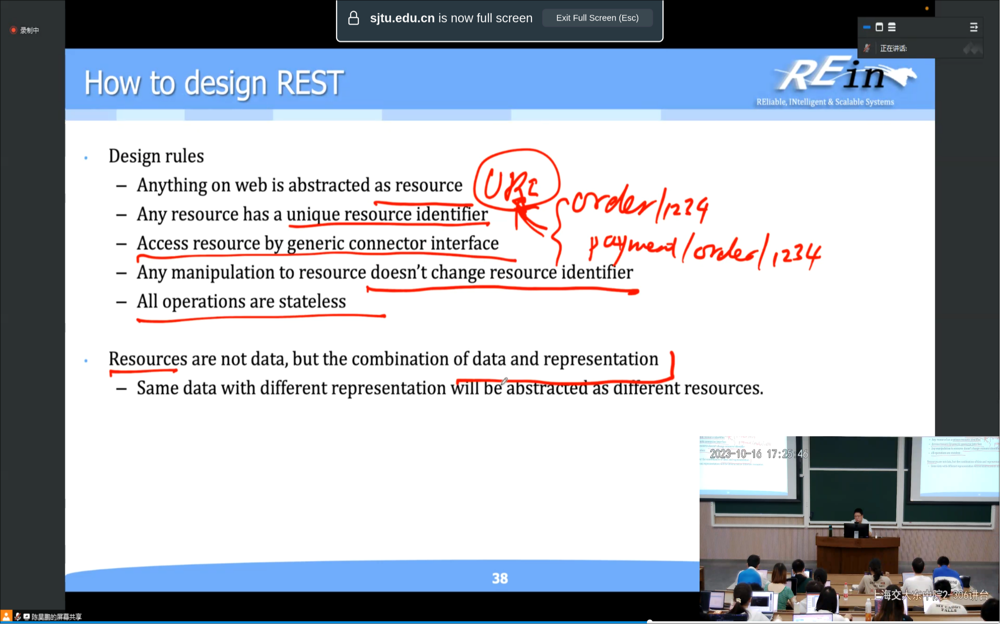
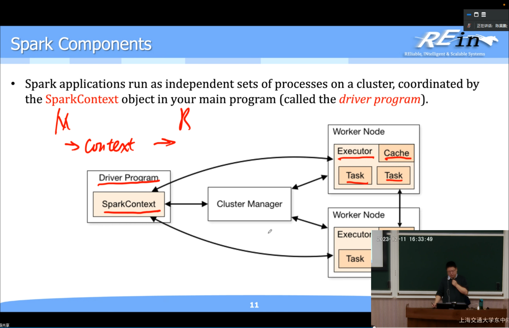

## Overview
- General Principle: more maintainable, more extensible, faster and less prone to single-point failure
  logseq.order-list-type:: number
- ---
- ## Stateful System
- HTTP protocol is a stateless protocol to communicate.
  logseq.order-list-type:: number
- To make sure that the state can be stored across multiple HTTP requests, HTTP Session is introduced and passed by each HTTP response from the server in the presentation of COOKIES.
  logseq.order-list-type:: number
- If we want to design a service, stateless service is clearly better for
  logseq.order-list-type:: number
	- No extra overhead for storing the states.
	  logseq.order-list-type:: number
	- Better extensibility since we don't need to maintain the session across the machines.
	  logseq.order-list-type:: number
	- Less complexity.
	  logseq.order-list-type:: number
- Spring Session Type
  logseq.order-list-type:: number
	- Singleton  --- always one instance in one process
	  logseq.order-list-type:: number
	- Prototype --- one method call one instance
	  logseq.order-list-type:: number
	- Session --- one session one instance
	  logseq.order-list-type:: number
	- Request --- one request one instance
	  logseq.order-list-type:: number
- Database Connection Pool size
  logseq.order-list-type:: number
	- Can not be too large since it will over consume the system's resources and dispatching them requires a lot of context switches. Can not be too small since it may not be enough to feed the requests
	  logseq.order-list-type:: number
	- Empirical formula: connections = ((core_count * 2) + effective_spindle_count (effective concurrent IO count))
	  logseq.order-list-type:: number
	- Core_counts *2 is the total number of capable threads handling and effective_spindle_count can be deemed as a IO buffer and even a bottle neck. 
	  logseq.order-list-type:: number
	- We don't need a really large connection pool. (Instance pool)
	  logseq.order-list-type:: number
	- Instance Pool Management is a crucial part of application system design.
	  logseq.order-list-type:: number
- ---
- ## Message Queue
- ### Shortcomings of a synchronous client-server model
- Deeply coupled.
  logseq.order-list-type:: number
- No delivery guaranteed
  logseq.order-list-type:: number
- No request without a request buffer. (preventing the a large overflow of data to overwhelm the whole system and consorting to a chain of timeout)
  logseq.order-list-type:: number
- Too much emphasis on requests and responses
  logseq.order-list-type:: number
- Communication is not replayable.
  logseq.order-list-type:: number
-
- Message Queue acts a meditator mode in the programming modal in the system design.
- Message Queue introduces a message buffer between the consumers and producers, it however adds another layer of complexity over the system. However, at the end of day, its overhead still is beaten by its architectural benefit. We can now program based on a message oriented model.
- However, message queue does not provide a direct way to expose the exception to the application. E.g. when the bookstore is out of stock, the message can not be delivered immediately to their clients.
- Kafka uses logs to track the ordered sequence of events and is a stream based server.
- Kafka allows a partition of streams and can be deemed as a partitioned DB-like service to provide better concurrency
- ---
- ## WebSocket
- Sometime we do not need synchronous communication and if our requests are handled asynchronously, we naively require a method to receive asynchronous response.
- WebSocket is an application protocol that provides full-duplex communications between two peers over the TCP Protocol.
- It consists two parts: handshake and data transfer.
- Although full-duplex, it still cost more resource so maybe too many websocket connections are also intolerable. We need to control them.
- ### HandShake
- HTTP Based
  logseq.order-list-type:: number
- Use bidirectional keys to authenticate
  logseq.order-list-type:: number
- logseq.order-list-type:: number
  ---
- ## Transaction Management
- ### Container
- In application architecture, a container is the runtime for proxying all the resources needed for a controller and its service to responce.
- For example, if a controller needs a transaction support, the container will supercede it and handle all the necessary outbound requirements. e.g. instance selection, transaction management etc.
- ### Transaction Policy
- Required  --- joining the transaction created by the outer scope of the current control flow
  logseq.order-list-type:: number
- Require New --- always create a new transaction when doing a data operation
  logseq.order-list-type:: number
- Mandatory -- must have a transaction when invoking this method. If not, throw an exception at the given point.
  logseq.order-list-type:: number
- ### Isolation Policy
- If we do not set correct isolation level policy, there might be some problems and discrepancies.
- Isolation level describes how two or more transactions can interfere each other
- Dirty Read Problem --- Reading an scheduled-to-modify data in another transaction when the current ongoing transaction on modifying this data has not been commited yet. (Disable Read Uncommited)
  logseq.order-list-type:: number
- Non Repeatable Reads --- Modifying a scheduled to read data in another transaction when the current ongoing transaction wants to read the data twice yielding different results on different tries. (Enable REPEATABLE READ)
  logseq.order-list-type:: number
- Phantom Reads --- Adding a new row to the table when the current transaction wants to list the data in the table for multiple time (SERIALIZABLE)
  logseq.order-list-type:: number
- ### Snapshot
- Some database takes a snapshot of the current view of the data.
- It can prevent any dirty reads, nonrepeatable reads and phantom reads.
- But it requires a lot of spaces and resources for generating the snapshots.
- ---
- ## Concurrency Control
- ### Optimistic Concurrency Control
- We insert a version control number and a last-modified time in the row of the table and abort and try the changes when the version has changed when writing back.
- ### Pessimistic Concurrency Control
- Simply by locking the whole row/table and do not allow interleaved writing.
- ### Virtual Thread
- Java thread enables the program to bind a runnable object to a thread object and virtual thread can enable temporarily release the thread and executes other codes when waiting for I/O resource just like Golang.  In short, a virtual thread in its lifetime isn't necessary tied to a specific OS thread.
- ### Live Lock
- Two threads are busy and waiting for each other, however unlike dead locks they are not blocked.
- ### Starvation
- A thread is always waiting for a certain resource but cannot acquire it.
- ### ReentrantLock
- A lock that is already acquired by the current thread and can be acquired by the same thread but invoking different guarded block
- ### Immutable
- Immutable objects are great for multithreaded applications since their fields can not be changed and the obly way to change is to allocate a new object to override it
- ### Concurrent Collections
- ### Executors
- Executor binds a thread to itself and acquire some resources and the executorService can receive a runnable object and callable object and runs the routine.
- One sample implementation is thread pool. The worker threads in thread pool are fixed and receives the callable or runnable object. This will not waste the system resource when too much requests or tasks flooded in.
- ---
- ## Caching
- Everything needs caching to boost IO intensive application.
- We sometimes need distributed caching to serve backend, cluster or even frontend applications such that we can skip extra data processing procedure.
- Caching Policy
	- Ring Buffer + eviction + LRU
	  logseq.order-list-type:: number
	- persist and eviction.
	  logseq.order-list-type:: number
- Some strategy: offloading those frequently accessed data into redis. (Redis also needs disk space)
- We read from the cache first  and if we want to modify the data and evict the cache.
- Still we prefer to prepare caching for read-only data instead of frequently modified data. Since we don't want introduce a lot of cache miss.
- Caching also provide better locality and provide more efficient memory indexing and searching.
- Memcached introduces the concept of slabs. It defines a series of slabs of variant size however it causes internal fragmentation.
- Memcached distributed the data using the algorithm of consistent hashing to decide which node should store the data.
- Consistent hashing should survive a lot scenerios. e.g. server shutdown, leaving cluster, a server joining the cluster so on without the loss of availability. Consistent hashing only impacts only its neighbor and only import/export the data from/to its neighbor.
- Cache even though it needs IO persistence, still it's magnificently faster than regular DBMS
- ---
- ## Full-text Searching
- Suppose we have unstructured data and we want the context of the words we request to search.
- Inverted Indexing: document the location of the word inside a certain passage and in a certain order.
- #+BEGIN_NOTE
  Still if the key is not present in the passage, how can we find a related passage and feed it back to the user.
  #+END_NOTE
- ### Lucene
- Indexing based on reverse method, word -> passage + conext location
- A format supported rapid search
- We can use separated indexing fields for different aspect we may be interested in. e.g. one for title, another for the title of the passage
- Each focus of the index is defined as the field and a file can have many fields e.g. title, subjects,content
- #+BEGIN_IMPORTANT
  Another idea is that we only create index for those less-frequent keywords so that the index will be more efficient and accurate.
  #+END_IMPORTANT
- Some fields can be vectorized and be stored in the index so that it can be presented to the user immediately for user experience.  So we can choose which field is stored or indexed or simply discarded.
- We have a global table documenting the word-file location and subtables documenting word-context location in specific file.
- If required words are not present in the keywords list, we need to vectorize it and implement a similarity search using the algorithm of cosine similarity.
- An unstructured chunk of data consists of different terms coming from different fields.  Fields may be stored and indexed, fields contain terms and term may be tokenized to generate index or may be unified as a whole to provide index.
- An index may be segmented and each field goes into its own segment.
- ### Ordering
-
- ---
- ## Web Service
- Web services build service upon  web protocols providing better and reliable accessibility and interoperability.
- Service means that the application is behind the implementation and only exposes  a bunch of APIs or RPCs across the Internet. This MUST be heterogeneous and hardware/language/operating system independent.
- Web Protocol is text-oriented and circulated on the Internet.
- ### SOAP
- General: Method -> Text
- SOAP refers to Simple Object Access Protocol. Object is defined in a specific convention and organized in XML.
- It describes the text's location, object type and the service URI.
- WSDL is language independent and the language can generate the implementation of a prototype interface based on the WSDL
- ### WSDL
- WSDL stands for web service description language.
- WSDL defines the method and its return type in XML. This is a good way to provide RPC or API definition.
- ###  Shortcomings of SOAP
- coupling with the message format
  logseq.order-list-type:: number
- coupling with the encoding of WS and attachment
  logseq.order-list-type:: number
- parse and assemble SOAP (extra overhead)
  logseq.order-list-type:: number
- need a wsdl to describe the details of WS
  logseq.order-list-type:: number
- need a proxy generated from WSDL
  logseq.order-list-type:: number
- ### REST
- General: Data + Convention -> Restful
- Data Driven, Decoupling the communication model between frontend and backend.
- REST stands for representational state transfer which represents the data object and its layout in a common form.
- Each resource can have different representations.
- Each resource can have its own unique identity.
- State is not maintained by the server.
- The representation of resource is a state of client.
- Client's representation will be transferred when client access different resource.  The state of the client changes according to different representation of resources.
- #### Definition
- REST is a typical Client-Server architecture with a stateless server.
- All states are hold in the messages delivered between clients and server.
- Server only process the requirements of data but its displacement depends on clients.
- REST is idiomepent and the client should have the ability to display the resource. The resource is self described
- We only transfer the data not the method definition!
- #### Design rules
- 
- 
- HTTP designs the type of action and url defines the resource the client is interested in.
- CRUD -> GET/POST/PUT/DELETE
- Resource -> URI
- 
- ### When
- Support communication across firewall
- Support application integration
- Support B2B integration
- Encourage the reusability of the code
- Not stand-alone applications
- Not Homogeneous applications in LAN.
- ---
- ## Microservice
- ### Concept
- Building small, self-contained applications and services which can bring great flexibility and added resilience to the code.
- Domain Driven Design helps us divide our applications into different tangent spaces and we can then implement different services based on them.
- Microservices are delivered in small, managable pieces, independent of others, preventing the case of single-point failure.
- ### Advantages
- Better maintenance: since the code base is small
- Improved Productivity: same reason
- Greater fault tolerance: the spotted fault is constrained inside a container and is  segregated from other containers so that the fault can not be spread to other parts of the system.
- Better modularity: simple
- ### Components
- Gateway: redirect the request to different microservices
  logseq.order-list-type:: number
- Service Registry + discovery : register the microservice and assign a KV location on it (load balancing)
  logseq.order-list-type:: number
- Config Server: a RAFT based KV service
  logseq.order-list-type:: number
- Breaker Dashboard: Runtime Health check
  logseq.order-list-type:: number
- ### Design Pattern
- Independent database + message queue for asynchronous server request handling.
- Independent database + gateway to redirect the requests to domain-responsible microservices.
- ### Fault Tolerance
- {:height 687, :width 958}
- Survilliance
  logseq.order-list-type:: number
	- Heartbeat system or periodical request
	  logseq.order-list-type:: number
	- Throwing exception
	  logseq.order-list-type:: number
	- Data gathering and service probing
	  logseq.order-list-type:: number
	- 
- Fault Analysis
  logseq.order-list-type:: number
	- Backtraces of requests and responses
	  logseq.order-list-type:: number
	- Logging analysis
	  logseq.order-list-type:: number
- Service restoration (primary+backup model  for fault tolerance)
  logseq.order-list-type:: number
- Service degradation (Temporarily disable some services)
  logseq.order-list-type:: number
- ---
- ## Serverless
- Only focus on the logic of the service instead of the server functionality (scheduler, transactin, security)
- In a serverless environment, the platform provides the infrastucture to build the applications with extremely lightweight functions.
- Platform handles all the starting, stopping and scaling chores.
- Event-driven workloads and flows into a service platform and chaining the functions to give different results.
- Stateless services very extensive
- ---
- ## MySQL
- ### Optimizing Overview
- Better Structured tables.
  logseq.order-list-type:: number
- Correct data types on columns
  logseq.order-list-type:: number
- Right indexes on certain columns to make queries efficient
  logseq.order-list-type:: number
- Storage Engine
  logseq.order-list-type:: number
- Row Format
  logseq.order-list-type:: number
- Locking Strategy
  logseq.order-list-type:: number
- Caching sized correctly
  logseq.order-list-type:: number
- ### Hardware Based
- Disk Seeks
  logseq.order-list-type:: number
- Disk Reading and writing
  logseq.order-list-type:: number
- CPU Cycles
  logseq.order-list-type:: number
- Memory Bandwidth
  logseq.order-list-type:: number
- ### Portability
- Wrap MySQL specific keywords in a statement with in a comment so that other database can use it.
- ### Indexing
- A B+ tree organized index
- Unnecessary indexes waste space and waste time and its variability depends.
- We need the right balance to achieve fast queries using the optimal balance.
- MYSQL uses indexes for operations such as
- Where Clauses
  logseq.order-list-type:: number
- Eliminate rows for consideration
  logseq.order-list-type:: number
- Optimize the lookup based on the leftmost prefix matching
  logseq.order-list-type:: number
- MIN MAX operation
  logseq.order-list-type:: number
- Sort or group a table if the sorting is done on a leftmost prefix of a usable prefix
  logseq.order-list-type:: number
- #### Cluster Index
- Primary key always has a cluster index based on a B+ tree index and B+ tree index location is related to the actual location of the data layout on the disk
- Query Performance benefits from the NOT NULL optimization because it cannot include any NULL values.
- NOT NULL optimization based.
- If primary key can not be determined and create an auto increment column to be used as a index.
- These unique IDs can serve as pointers and server as another table to be a foreign key.
- #### Spatial Index
- NOT NULL geometry valued columns
- SPATIAL index must be SRID-restricted to estimate the distance between multidimensional data
- #### Foreign Key Optimization
- Duplicated columns or less frequently accessed data might be separated to different tables.
- However, we need to perform joining when accessing the full record of the data. The latency of one single record will increase but the amortized cost is lower.
- #### Index Prefix
- We can use the prefix character s of the column to create index
- #### Multiple Column Indexes
- An index may consist of multiple columns and maintain  a partial order relationship. The order counts. If we preempt the searching using wrong order, the index will not take effect. The first must be used before using the second field for indexing
- **B -Tree is optimized for comparison or BETWEEN operators ALSO LIKE will benefit too (Only happens when the leftmost prefix matches )**
- **Hash Index is optimized for key-value searched.**
- **Ascending/Descending can be better when ordered by is used.**
- 
- #### Beyond Indexing
- We can use prefetch the data to provide spatial locality for data access.
- ### Data Size Optimization
- Design the tables to minimize their space on the disk
	- Compaction for data
	- Less alive memory needed when loading chunks of records
	- Smaller INdexes
- #### Techniques
- Table Columns
  logseq.order-list-type:: number
	- USE Space Efficient Data Type when Possible
	  logseq.order-list-type:: number
	- Declare the data as NOT NULL if possible
	  logseq.order-list-type:: number
		- No NULL comparison needed
		  logseq.order-list-type:: number
		- No Bit representation on null
		  logseq.order-list-type:: number
	- VARCHAR(Header and data stored at the end NULL sized favored) vs CHAR (compact sized and header)
	  logseq.order-list-type:: number
		- 8196 is fixed and varchar holds a pointer of data that is too large for a row to store
		  logseq.order-list-type:: number
- Row Format (VARCHAR)
  logseq.order-list-type:: number
	- DYNAMIC
	  logseq.order-list-type:: number
	- COMPACT
	  logseq.order-list-type:: number
	- COMPRESSED
	  logseq.order-list-type:: number
	- REDUNDANT (CHAR N uses N x the maximum byte length)
	  logseq.order-list-type:: number
- Indexes
  logseq.order-list-type:: number
	- Primary index should be as short as possible
	  logseq.order-list-type:: number
	- Composite index is better and the leftmost fields of the index should be most frequently used also can filter out lots of other rows
	  logseq.order-list-type:: number
	- If indexed field is too long, better use a smaller data type
	  logseq.order-list-type:: number
- Joins
  logseq.order-list-type:: number
	- Declare columns with identical information with identical data types
	  logseq.order-list-type:: number
	- Column Names should be same
	  logseq.order-list-type:: number
- Normalization
  logseq.order-list-type:: number
	- Reduce the redundancy of the data
	  logseq.order-list-type:: number
- Data Type
  logseq.order-list-type:: number
	- String vs Character
	  logseq.order-list-type:: number
	- 
	- > Note That 8KB is approximated the half size of your page.
	- If a table contains a lot of string columns, store it in another tablle
	- A large blob containing a lot of textual data with a pointer pointing to blocks on disk
- ### Table
- Table is opened concurrently by each session.
- Mysql has no limit on the number of tables and databases.
- 
- Mysql has a hard limit 4096 columns per table
- Also the row size has maximum and if the row size is too long
- Less frequently accessed columns should be moved out of the current table and store in another one.
- Max row size limit is 64KB (Based on the pagesize of the innodb page size) (On varchar)
- However, in char it's contrained for half page size using char
- If the data is significantly larger, Just USE BLOB AND TEXT
- #### Temporary Table
- Temp Table is created in a lot of evaluations  however the temp table is allocated in memory (communication, order by, union, group by)
- #### Optimize Table
- If the table size is not growing, we can use optimize table and reorder and combine the data file and rebuild index file accordingly.
- 
-
- ### Configuration Settings
- Max connections
- Table open cache: caching the connections and the number of files can be preempted to be opened. Related to the file descriptors (cannot be too large and cost a lot of resources)
- When the table is closed and only if the cache is fulled and no longer used, the table will be evicted from the cache.
- ### Transaction Management
- AUTOCOMMIT = 1. Every clause is executed in transaction mode but we might need to wrap some clauses in one single transaction.
- Alternatively, we might need to pack read only together so that we do not need locking the record. But it might introduce inconsistency between buffer and disk.
- Buffer Pool  decides on the cache size and reduce the frequency of data persistence.
- We might need to divide a large clause into small clauses and issue the COMMIT statements periodically.
- **We don't want a long running transaction and need to determine the isolation level correctly**
- ### Bulk Insert
- We might not need foreign key checking, unique checking for better performance
- ### IO Optimization
- Increase the buffer pool size
- Change the fsync types and each buffer refers to one session
- configure the fsync threshold
- We can optimize based on the storage type whether it's tablespace and temporary tablespace.
- ### Memory Table
- Hash index considered first
- 
- ### Backup & Recovery
- Online Backup : Service still running but needs isolation when hot data is being backed up
- Offline Backup: Service down but simpler
- SQL Output: Insert based. Best portability across RMDBS
- CSV Based: can be read everywhere
- Physical Based
- Snapshot Backups: Logical copies of copy on writes after chunking
- #### Full Vs Incremental
- Full includes all the data (slow but complete.) Full log backup at a given time span and delete all the previous backup.
- Incremental includes the data modification (fast but rapid writes) binary log based
- #### Backup (Primary-Backup Models)
- Load Balancing and perform backups
- ### Partitioning
- We need to separate the table based on the features of the data and each client accesses its closet match table set.
- Data can only be split horizontally in mysql.
- Benefit: Data removing. Store more data in one table can be held on a single disk. Some queries can be optimized based on partions
- #### Partition Type
- Range Paritioning (e.g. On Academic scores)
	- Every partition is continous and not overlapped.
	- Range Partition can operate on different columns by partial order
- List Partitioning (e.g. Discrete based)
- Hash Partitioning (e.g. On Date)
- KEY partitioning (use hash on column cannot use an external function)
- Partitions can have subpartition (now it's just like a tree)
- NULL goes into the partition with the smallest range
- ---
- ## MongoDB
- This DB works on semi-structured data since the new data collection system like today some fields might be missing and fields are always rolling. Schema is not strict.
- RDBMS's biggest flaw is its relational based and is the bottleneck of batch/flow processing and restricts the data scheme. If we want to partition the data, we have maintain the relationship between different tables.
- In stream processing,  schema is not everything and sometimes the data we want to process may have missing fields or columns
- Collections or sub collections have no relationship still it's for categorization.
- We can create geological index and cluster index in mongodb just like mysql. (with 1 for ascending -1 descending)
- MongoDB document oriented schema-free and enable us to add special or polymorphic fields/attributes to an object from a collection.
- MongoDB can use find on special fields and values without the constraint of a schema. e.g. Some fields can be missing and we can filter out those objects in a collection. This allows searching among data from different structure.
- Loosen Object KV system.
- MongoDB can easily be replicated and sharded among different machines. A shard can be also divided chunks and the smallest granule is the chunk. MongoDB master will track the chunk location and will auto balance out the chunks from different machines. However, the timespan locality counts. The data access should be balanced.
- ---
- ## Neo4J
- ### Graph Data
- Graph data consist of graph entities and the relationship between different entity (different attributes, different edges)
- ### Graph Database
- The Graph Databases are generally built for use with transactional systems.
- It comes with a storage engine and underlying engine.
- RDMS/NoSQL Lacks  multi-level relationship support. It can only rely on excessive joins if one wants to maintain a bunch of relationships between different models. We must switch to the graph database.
- Graph Nodes are labeled with properties and constructed by edges of relationships. Unlike RDMS, which only supports the general relationship between tables and tables. RDMS's strict structured schema model can not describe this kind of relationship model. They are constucted virtually by joining.
- Graph Database if we want a chain of nodes on certain relationship, this is easily supported and costs way less resources than traditional RDMS (Joining requires a lot system resources and time)
- ### Storage Model
- Neo4j partitions the graph into subgraphs and store them in different files.
- Nodes and Relationships are segregated and strictly partitioned. Attributes are stored in double linked list.
- An edge stores the starting point and the terminal and four pointers of prev/next edges.
- ### Graph Computing (Graph Attention)
- Embedding of the graph (its edges and nodes)
- ---
- ## LSTM Based KV
- Observation: Sequential is significantly faster than Randomized IO. Latest Data will be accessed lately (locality!)
- Modified and Delete: Create a new record instead of accessing old one (a lot faster)
- Multi-level: space amplication is smaller.
- 
- 
- Write Amplification/Stall : Happened when a level is full and triggered merging with other levels
	- Optimization:
		- Asynchronous Compaction in the background
		- Load balancing the written data to different replicas or data centers or (row/column transformation)
		- 
		-
- Read Amplification: Search levels to find old data. Since multi-level, old data needs a lot of time to access
- ---
- ### HTAP
- Hybrid Transactional Analytical Processing
- OLTP: Online Transaction Processing  High Concurrency, Low Latency, Small amount of data in one transaction (row based)
- OLAP: Online Analytical Processing Low Concurrency, High Latency, High throughput, Large chunks of data of streaming processing (column based)
- HTAP will analyze the transaction and will separate the copies and online dispatches them into row/column based storage.
- We can use different database (RocksDB) to store row datra or column data.
- ---
- ## VectorDB
- In machine learning, a model generates a lot of embeddings which are the immediate representation of data and sometimes we need to store them for further analysis and better performance (we offload the data in the storage)
- Similarity, like Inverted index, we need to measure the similarity of the data we give.
- The database generates index on vector and fuzzy queries the vector.
- Random Projection : Converting high dimensional matrix into different 1-D vectors and split the vector into different chunks of codes
- Locality Sensitive Hashing: Hashing the vector and measure the locality first result
- ---
- ## InfluxDB
- Multilevel Timeseries Merge Tree (Something like Log structured Merge Tree)
- A starting point and offset compressed data
- ### Time-series dataset
- timestamped KV data (a timestamp and tracked time data ) monitored, tracked, downsampled
  logseq.order-list-type:: number
- high throughput
  logseq.order-list-type:: number
- can withstand some faults
  logseq.order-list-type:: number
- uninterested the distribution or attributes among an interval of data
  logseq.order-list-type:: number
- ### Data Elements
- Tags (Set): participated in indexing (Commonly Accessed) (Optional)
- Fields (Set): Data Value
- ### Design Principle
- Read/Write > Strong Consistency (Real-time is the king)
- Schemaless Design (Lenient)
- Time Series Data is not ephemeral
- Multiple data in the same indentical point aren't store twice
- WAL Written and TSM Fields.
- The data has lifetime, old data will be discarded.
- ---
- ## DataLake
- Today's big data  requires us to present different format of files to suffice different kinds of demands and designed for different scenerios and analyze them online.
- One technique is to use datawarehouse to store all the data into a high-demensional fact table using the techinque of ETL (extra overhead ). However, this suffers the loss of accuracy and transformed data will accumulate complexity for downstream tasks.
- DataLake is a system or repository of dat in its natual/raw format, usally object blobs or files. It is a big centralized shipping and storing center for all the data stored in native/natual format for all the system input/output.
- Downstream tasks can then use the data flow to do stream or batch processing, leveraging real-time data analysis.
- The main difficulty: a unified query language or maybe a data middleware driver to import the incoming stream.
- 
- edge processing -- better latency and preprocessing on the edges
- 
- 
- ---
- ## Clustering
- Storage --- Primary - Secondary Storage instead of database storage (availability first)
- SAAS --- Multi-tenant
- Mem / Computing is all separated
- ### Overview
- high concurrency many users from many different places
  logseq.order-list-type:: number
- long-running cannot suffer shutdown
  logseq.order-list-type:: number
- large numbers of transactions per second
  logseq.order-list-type:: number
- high system load
  logseq.order-list-type:: number
- A cluster should provide a unified single system view to its users or clients.
- A loosely coupled group of servers that provide unified services to their clients.
- Database Cluster --- availability Server Cluster --- better performance over load balancing
- 
- Some requests are not ideomptent, if the fault happens when such operations are ongoing, the operation may not be undoable and should be manually intervened.
- ## NGINX (Load Balancer)
- performance first --- balance the overloading
  logseq.order-list-type:: number
- Several strategies and should survive session failover.
  logseq.order-list-type:: number
- Session should be persisted across the nodes in the cluster (redis based ? ip-hash balancer ?)
  logseq.order-list-type:: number
- ---
- ## Cloud Computing
- ### Overview
- Cloud computing refers to both the applications delivered as services over the Internet and the hardware and systems software in the datacenters that provide those services.
- Cloud computing uses the Internet and receive the tasks from the Internet and accumulated the resources over a large number of machines.
- Unlike grid computing, which simply connects the machines, in cloud computing, the cloud provider build a large virtualized and scalable  computing platform.
- Multitenant and different resource sharing strategy
- ### MapReduce
- Batch Processing framework
- Multiple mapper and multiple reducers and worker asks the task from the master and master dispatch the task to the worker. The master observes the process of the worker and if the worker is dead, the master may dispatch the batch to other worker.
- In Hadoop, the heartbeat and the map is working on the same thread to prevent the case of thread collapsing and live locking.  Therefore, heartbeat messages may arrive at random intervals.
- ### GFS
- ### BigTable (a large distributed KV)
- Managing structured data that is designed to scale to a very large size.
- No strict schemas and relationship.
- Column family to support unstructured data.
- Timestamp based
- Multilevel tablets based table and divided and managed
- ---
- ## Edge Computing
- The communications between the edges and the center is not reliable.
- We may want to offload the computing from the center to the edge and the center amortizes some basic calculations to its counterparts and collect the intermediate data.
- The workload can be distributed across different clients.
- The edge computing decides how the overload can be dispatched to different remote nodes to provide better user experience. (how the data is computed)
- Fog: the offloading data from the cloud to the edges
- ---
- ## GraphQL
- A web query language over the HTTP to query or mutate structured data from the backend.
- A substitute for REST query for querying and mutating complex data model.
- Server provide GraphQL runtime for the clients and it's really like SQL language but the query language should be a convention between the client and the server
- ---
- ## Container
- A sandboxed process and the resource it uses is isolated from each other. It leverages kernel namespaces and cgroups for simulating discrete filesystems and process for containers.
- An application is packed inside a image and unpacked to a volume and simulate the filesystem upon it.
- The container provide all the runtime inside the image and can easily deployed on every machine.
- ### Container vs VM
- Container does not come with a guest operating system and full hardware simulation. it depends on the container runtime and runs on one single operating system without any sort of virtualization but resource isolation. It's more portable and efficient.
- Docker creates a set of namespaces for that container and provide a layer of isolation.
- Combiner and Mapper works together.
- ---
- ## HADOOP
- A framework that allows for distributed processing of large data sets across clusters of computers using simple programming models.
- Can scale up from single server to thousands of machines.
- Does not rely on hardware.
- {:height 554, :width 849}
-
- ### MapReduce Internal
- Map File Split --- HDFS Block size to split the file for mapper
- When the task timeout, the master reschedule the task to another worker assuming that the current work responsible for that task is already dead.
- Reducer is responsible to certain range of map files and reduces the output
- The bottleneck however is on the immediate files on the disk
- Optimization:
	- Partial reduce in the current mapper -- Combine
	- Mapper intermediate output will be sorted and shuffled to different reducers based on the reducer path
- Shuffle will partition the immediate files to different reducers.
- Sort will decide which record goes into the certain partition.
- Reducer can use two different modes.
- 
- In short, one is partitioned and shuffled directly to reducers
- Another one is partitioned into smaller granule and the reducer concurrently asks the task and preempt the task.
- Reduce only happens after Map
- JobTracker: tracking the jobs of map reduce tasks
- Once a jar is running, the job client is invoked and the jobtracker get input from the HDFS and gets the job id and copy job resources from HDFS from the Job Client.
- Job tracker then retrieves the splits and intialize the job and the task tracker works as a worker and receive the task from the job tracker and job tracker will restart the task on the other work.
- Job Tracker is the single point failure point (YARN works a distributed file )
- ### Shortcomings
- A lot of Disk IO overhead since reading and writing immediate files
- If one mapper suffers network partition, the reducer can not effectively receive the intermediate partitions.
- One optimization: do not merge on the mapper side, consider shuffling the part of map spill out
- ### YARN
- To tackle the over complexity of job tracker, Hadoop Introduces YARN
- Node Manager has one tracker per application in the node manager.
- Resource manager is responsible to dispatch the resources to the node manager.
- Node Manager's container tracker and job tracker is responsible for the application container it's running on.
- 
-
- ---
- ## Spark
- ### Overview
- 1. Works for Batch/Streaming Data.
	- Batch Data still needs multistage processing but stream does not. Stream works on a pipeline and endlessly process the dataflow.
- 2. SQL Analytics
	- Execute fast and ANSI SQL queries on resilient distributed dataset which can be distributed on different machines and perform the same transformation
	- Fast In Memory Storage
- 3. Data Science at scale resort to downsampling of petabyte-scale data
- 4. Machine Learning Support
	- Spark RDD Support IID split of the dataset
- #### In Memory
- The RDD is defined in memory but the memory is limited so we need better management.
- #### Architecture
- 
- Driver Program maintains the spark context and spark context interacts with the cluster manager and its executors and each is multithreading. This is the same as the Hadoop Design. Spark is agnostic to the underlying cluster manager.
- The Driver Program must be network addressable from the worker nodes.
- In Spark, the scalability and runtime cost's slope running. If the file size or task size is too small, the significant overhead lies in the scheduling.
- #### RDD
- A fault-tolerant collection of elements that can be operated on in parallel and can introduce fault tolerance mechanism on different machines.
- Two Ways to create RDDs: parallelizing an existing collection in driver program or referencing a dataset in an external storage system.
- RDD will be partitioned on different machines once file is imported.
- After partitioning, transformations and actions can be performed
	- transformations: create a new dataset from an old one. Lazy computed.
	- actions: return a value to the driver describing a certain attribute of the dataset.
	- Only action will trigger computation.
	- Spark will remember the computational graph and calculate them simultaneously
- RDD can be cached and compressed. Since the data is stored by column in RDD, then RDD can be compressed.
- Since Persistence is not regular, compression can be used.
- Better partition. If no parition, in some task which involves joining operation, we need to walk the whole table to collect the record.
- Paritioning Hashing is based on the size of the dataset. Hashing and Partioning on larger target yields better performance.
- #### Dependencies
- 
- When RDD is missing, The RDD will be recalculated based on the dependency graph\
- 
- #### Spark SQL
- Works on the dataframes and datasets like SQL.
- #### Spark Streaming
- Not real streaming but buffer the data stream into batches based on the sliding window of time frames.
- ---
- ## Storm
- Based on streaming data strategies.
- Terms
- Sprout:  a stream of input data
- Bolt: The transformation operator
- 
- MapReduce jobs = Storm Topologies
- Nimbus = JobTracker = Resource Manager
- NodeManager = Supervisor
- Bolt and Sprouts are nodes and connected on the graph DAG
- Tuples are the basic data model and serialized over the graph.
- Stream grouping: hashing the output and distribute it to different instances.
- Topology is like a job and submitted to the master
- ---
- ## Zookeeper
- Consensus and cluster management  among lots of inferences
- ---
- ## HDFS
	- ### Requirements:
	- Large Data Access
	  logseq.order-list-type:: number
	- Streaming Data Access
	  logseq.order-list-type:: number
	- Commodity hardwares
	  logseq.order-list-type:: number
	- ### Concepts
	- NameNode: serving as a metadata server and stores the metadata and mapping. Gets where the data lives and check whether the file lives and replies to the client where the file lives and instruct the clients to read the data from the DataNode.
	  logseq.order-list-type:: number
	- DataNode: the place where the real data lives in. Does not know where is the data and how the data is organized. It only sends to heartbeat to the namenode.
	  logseq.order-list-type:: number
	- #+BEGIN_WARNING
	  We need to ensure the replication of the machines in the DataNode and replicates the whole system if possible to provide replication of namenodes system as well as the datanodes.
	  #+END_WARNING
	- #### DataNode
	- Access ops follows the Adjacent - first,  Balance Second rule.
	  logseq.order-list-type:: number
	- HDFS usually have one node per cluster.
	  logseq.order-list-type:: number
	- One file is split into different files and restored distributely across different machines.
	  logseq.order-list-type:: number
	- Replications should succeed on every replica before reporting the data chunk has been successfully written.
	  logseq.order-list-type:: number
	- Heartbeat: **Block Report**
	  logseq.order-list-type:: number
		- Block Report holds the list of all blocks on a datanode.
		  logseq.order-list-type:: number
		- Namenode then can collect all the block reports and check the integrity of the file.
		  logseq.order-list-type:: number
		- If replication integrity checks fails, another replication process should be instigated by the NameNode.
		  logseq.order-list-type:: number
	- #### NameNode
	- Has logging and takes the responsibility of managinng fault tolerane.
	  logseq.order-list-type:: number
	- Replication factor is the times about the chunks are replicated. 
	  logseq.order-list-type:: number
	- Last Block is not the same size as the previous blocks.
	  logseq.order-list-type:: number
	- Files in HDFS are write-one and have strictly one writer. 
	  logseq.order-list-type:: number
	- #+BEGIN_TIP
	  Recall that the orders in the book store can be stored here. Since it's immutable.
	  #+END_TIP
-
	- ### Limitations
	- High latency and low-throughput. HDFS uses the concept of partitioning and stores the files in different batches.
	  logseq.order-list-type:: number
	- Large volumes of small files accesses.
	  logseq.order-list-type:: number
	- Large volumes are restricted and should be everything.
	  logseq.order-list-type:: number
	- #### Fault Tolerance and Persistence
	- There's no free dinner. Fault tolerance vs Performance. So the distance partitioning and replication factor counts in HDFS
	  logseq.order-list-type:: number
	- Replication factor should be set to three and one of them is assigned as the primary.
	  logseq.order-list-type:: number
	- #+BEGIN_IMPORTANT
	  SafeMode
	  If replication checks fails across the DataNode on Name, any chunk of files that does not satisfy the replication factor constraints should be replicated in the DataNode until the replication constraint is satisfied again
	  #+END_IMPORTANT
	- 3. NameNode has a edit log just like in CHFS which documents all the metadata changes. It is redo-undo log.
	- 4. DataNode has a CRC operation when guaranteeing integrity of the chunk file.
- ---
- ## HBase
- ### Overview
- Unstructured database on the HDFS
- Random, realtime read/write access of column based data
- support billions of rows X millions of column
- HBase is 3D based. It turns the element in the row into a cell enabling it to record  data with different timestamp.
- HBased is modeled after the BigTable Paper and built atop of the HDFS
- ### Architecture
- When a table is too large, the HBase documents the metadata which contains the layout of the mult-layered table. Each Table is chunked and distributed in the HDFS.
- Scale linearly for the sake of the DataNode and NameNode representations provided by the HDFS
- It can work on sparsely populated tables made from commodity hardware
- Since no relationship present, we can easily split the dataset **horizontally**
- Strictly consistent.
- Bloom filter based and predicate push down via server side filters (load balanced aware)
- Thrift gateway and Restful Web Service
- ### Labeled Tables
- Everything can be row keys in byte ordered and everything is accessed via the table primary key.
- The key is only way for queries and no queries on other columns fields.
- The columns are structured in the column family  and compared to structured RBDMS, we can flexibly add new column to column families and since the storage is column based if the primary key in the certain row is missing, we can simply default it.
- Cells are versioned, rows are sorted and columns can be added on the fly.
- HBase is a multi-dimensional map.
- Rows are sorted alphabetically by the row key and related rows are near each other.
- Column family physically corelates and are physically stored together.
- Cells that appear to be empty do not take space actually and are sparse.
- ### Namespace
- A namespace is database like in RDMS
- ### Regions
- Tables are automatically horizontally.
  Each region is a subset of table rows.
- AS the table grows, the number of its regions grows and distributed on different machines.
- ---
- ## Hive
- Hive, a framework for data warehousing on top of Hadoop.
- The common action on the fact table is extract, transformation, loading from the table.
- Hive provides HQL and queries on the data warehouse.
- Hive compiler generates map-reduce jobs for most queries and provide query features
- It supports partitioning and the partition index is a  virtual column not part of the data itself
- ### MetadataStore
- Storing the metadata of one single file and the central repository of how the data is managed across the HDFS.
- ### DML Operations
- HQL manipulating is lazy computed and just like spark transformation. If data is being loaded, the speed is really fast. In DataWarehouse, the data is not modified.  **This is schema on read. In comparison, RDMS is schema on write (which is responsive immediately)**
- Tables can reside in HDFS and even access extern tables that reside in the local file system.
- 
- The file stored in the Hive is in raw format.
- Partition can only be using one single metrics however using subpartition you can have different metrics.
- In Hive, subpartitions are called buckets.
- ### RCFile
- Row columnar File and rows are horizontally split and vertically partitions each row split in a columnar way.
- 
- 
- Easily to compress, since each element in one single column is related
- #### Notes
- DataWarehouse is OLAP database and all the data should be stored in columns.
- Column based storage can easily be compressed since the number in columns is statistically resembled, which can significantly boost the IO speed.
- ---
- ## Flink
- Flink is a framework to process stream-like datastream.
- The datastream is organized in the events and how we can partition them for different clusters.
- And Also, if the data is partitioned , how to handle the out-of-order datastream and synchronize them?
- Moreover, the data has states for real-time analysis and we need to analyze one single user's behavior. Some events come from one source and we need simply to group them
- ### RocksDB
- Flink normally stores the state of the topic in RocksDB.
- ### Architecture
- Events are mapped and sinked to another sink