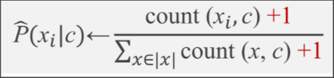
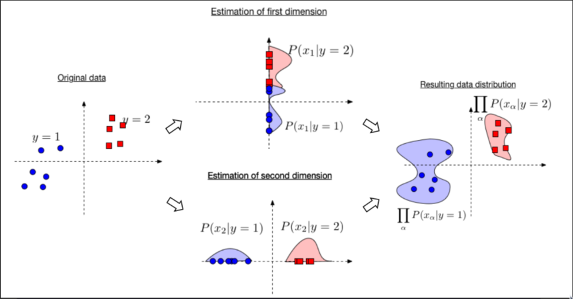

- 
- Bayesian Classifiers based on information theory where as the joint possibility can be inferred by the experiences.
- The possibility of an event is controlled by the prior knowledge by a set of variables $c_n$, we can calculate the possibility then use the bayesian rules to estimate the possibility for each set of variables $c_n$.
	- $P(C_i|x) = \frac{P(x|C_i)P(C_i)}{P(x)}$
- The naive way is to propose the following formula.
	- $P(x_i | c) = \prod_{n=1}^k P(x_n|c)$
- To combat the deficiency in missing count resulting the loss of possibility, we introduce the Laplace Smoothing.
	- ((6510ef93-4a82-44e4-a2c8-407a75622a29))
	- 
- ## Interpretation
- Naive Bayesian Classifers assume that each variable is conditionally independent from each other in possibility so that the computationally intractable can be inferred by the multiplication of individual variables.
  logseq.order-list-type:: number
- 
- ## Advantages
- Fast
  on training, requires only a single pass over the training set
   on testing, also fast
- Competitive performance
  when assumption of independence holds, NB performs better
  it also perform well in multi class prediction
- Simple to update upon additions or deletions of training
  examples
- easy to maintain
- ## Disadvantages
- Underfitting because the complexity is fixed and low