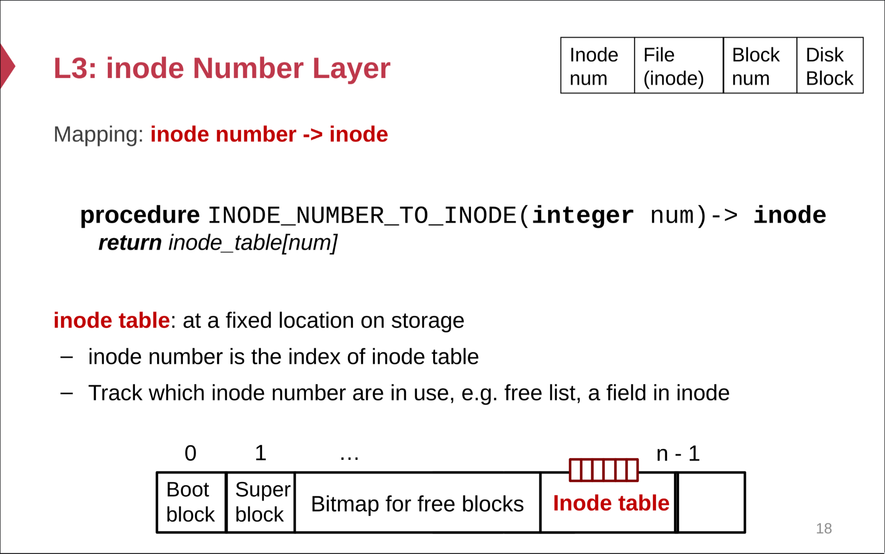
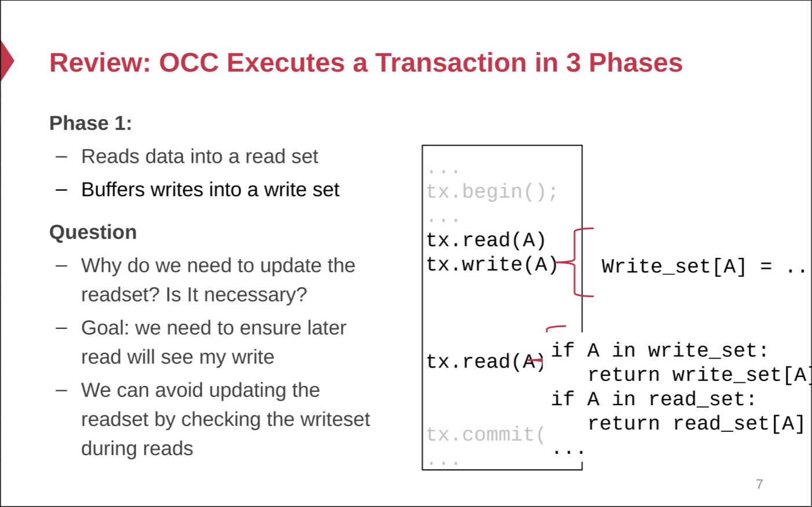

## Inode-FS
- ### Layers
	- Block Layer:
		- 4KB Size per block (maybe but adjustable)
		- Contains bitmap to track the usability of the block
		  id:: 654f666b-a243-49f6-8077-f1324f3092b4
	- File Layer:
		- **Representative**: Inode
		- Resides in the block too. Holds the location where real data stores and the file's **metadata**.
		- 
		- Indirect holds another map to block which holds other indirect blocks
		- Only the direct block holds the real data block which stores the actual data
	- Inode number layer
		- Just an array stores behind the block bitmap's with also inode's bitmap.
		- **Note that: in modern ext4, inode table has actual inode inside instead of the block number, this is different to lab assignment design**
		- Indicates the block number of the inode layer
		- 
		-
	- File Name Layer
		- Hide metadata of file management
		- Separate the directory type and regular file type
		- Holds the mapping from the filename to the inode number.
	- Path Name Layer
		- Recursively look up the directory inode untils it lands on the regular files.
		- The inode number of the root directory is fixed. In the case of the ext4, it's assigned with 1. Note that we don't have number 0 here, since it represents the dysfunction of the file system.
	- ### Links
		- Two semantic abstractions
			- LINK (from, to) --- to's name to from's inode
			- UNLINK (name) --- decrease the reference count of the inode where name points to.
		- Create Shortcut from one link to another.
		- We store the reference count inside the inode.
		- We increment the refcnt of the inode if one link is formed. The default is always one.
		- When the reference count of the inode reaches zero, we can safely remove the inode and free the data blocks.
		- Note that soft link doesn't increment the reference counting.
	- #### Renaming(from,to)
		- When renaming, it should be guaranteed that LINK(from, to) is done atomically and should not fail.
	- #### Two Types of lINKS
		- Soft Link --- only associates the destination with the name
		- Hard Link --- associates the destination with the inode number
	-
- ## FAT System
	- **Only Two Layers**
		- File associated entry
			- starting from the root and finds the first block of the backed file and traverse the linked list.
		- Free List
			- contains the free block number and perform allocation and garbage collecting based on this free list.
		- 
		- Linked List Structure
			- Point to the end of the block list when ended.
		- Directory
			- Hold the next file entry until it reaches the end.
			- Hold the metadata of the file and the entry of another file/directory.
			- 
		- Advantage:
			- Naive and simple --- used as the supporting file system for efi when designing the UEFI boot system
- ## File System Abstraction
	- ### Open
		- Gives the process a fd in its own fd table which points to an entry in the file table
		- Each process has its own fd table but shares the file entry table on the OS level
		- One open increase the reference count of the file table entry and the file itself,  each child process will increase also
		- However, another open will get to another entry separating the file cursor apart from each other
	- ### Close
		- Remove the fd table entry from the process
		- Decrement the reference count of the file table entry
		- Remove the file table entry if the reference count reaches zero
	- ### Read
		- Move the file cursor and read the data block.
		- Update the **Access** time (which means write operation )of itself and its all ancestors recursively (Can be disabled via system-level noatime mount)
	- ### Write/Append (No need to mention here)
	- ### Sync
		- Flush the page cache to the disk
		- Ensure that all the content is flushed into the disk on time or on recovery whatever it may happen.
	-
- ## RPC
	- > RPC Stands for Remote Procedure Call which provides an easy-to-use executional and functional abstraction without coding the details for the remote interaction.
	- ### STUB
		- STUB Translate the function call into the internet message and transmit the requests and responses accordingly over the network ports.
		- Responsibility:
			- 
		- #### Request Message
		- 
		- #### Response Message
		- 
	- ### Parameter Passing
		- Parameter Passing needs a machine-independent, language independent byte encoding.
		- Two types of format representations
			- Human Friendly: more verbose but needs more bits to store
			- Machine Friendly: less verbose but needs less bits to store
	- ### Failure Recovery
		- Network Failure can happen when on requesting, server transmission and even responding.
		- Requests resending is not tolerable since a lot of transaction is not Idempotent
		- We need semantics that can support that only zero or one request can be sent to the server for responding.
	-
- ## Network File System
- ### NFS
	- We don't have open and close here We only get a mount operation which returns a file handler to the client.
	- #### File Handler
		- File System Identifier
		- Inode Number -- Dealing with renaming
		- Generation Number  -- Versioning (in case of deletion and reallocation happens)
	- #### Performance
		- We need caching on client sides to get ride of excessive read,readlink,getattr,lookup,readdir
		- We need cache binding, metadata and directory binding
		- Dealing With Cache Coherence
			- Type 1: Guarantee read/write coherence on every operation or simply for some kinds of operations
			- Type 2:  Close-to-Open Consistency (we need to perform getattr when opening and flushing all writes when closing)
- ### VFS
	- In memory abstraction over different implmentations
	- Provides a highly abstracted set of APIs including OPEN, READ, WRITE, CLOSE
	- Even FS with no real local files supported can be abstracted this way (Proc FS)
	- #### Validation
		- Both server and client save timestamp of files
		- We always need to validate the consistency between the client and the server
		- Data Block should be flushed on close if possible.
		- 
		-
	- #### Performance Improvment
	- 
- ### GFS (Compared to the naive design in the CHFS)
	- #### Distributed Block Layer
		- Data Blocks are distributed across multiple data-server
		- Inode table is stored on the master server and path name resolution on the metadata server.
	- #### Interfaces
		- Only Create/Delete/Open/Close/Read/Write
		- Additional: Snapshot/Append
		- Unupported Ops: Link, Symlink, Rename
	- #### Architecture
		- Master + N Replicated Chuck Servers
		  Features:
			- Large Chunk  (64MB)
				- Reduce the need for frequent communication with master for chunk location info
				- Make it feasible to keep a TCP connection open for a extended time
				- Master Stores all metadata in memory
			- Master:
				- Maintains the metadata of the whole file system including the locations of the chunk and filename -chunk mappings.
				- Store all the data in the memory and persist an operation log
				- Chunk Location is not stored persistently for consistency management
	- #### Client
		- No OS Level API (No syscall / trap)
		- Interacts with master and chunk server directly
		- No caching
	- Operations:
		- 
		- 
		- 
		- 
		-
- ## Consistency Models
- ### Strict Consistency
	- Coherent to the global time no compromise.
	- Operation happens one by one and no overlaps
- ### Sequential Consistency
	- Consistent issue to complete in a single program in one machine
	- No operation reordered due to network latency with in that program
- ### Linearizability
	- If operation is issued, it must be able to see to the changes happened before it's issued
	- If certain operations overlaps from one another, the consistency is relaxed.
- #### Implementation
	- We use a sequence number just like TCP to reorder the write operation
	- Read Operation Can be relaxed by local caching so we can read the cache.
- ### Causal Consistency
	- Causal Consistency is a higher level of consistency meaning that one operation should have an effect on the sequential order of operations. We don't want some conversation with an important context that goes out of order.
- #### Implementation
	- Ordered operation log --- log the operation before performing it and reorder the log based on some order --- Time
	- We issue the <Time T,  Node ID>  to reorder the logging and to use as a tiebreaker if timestamp comes to a tie.
	- Step by Step clock synchronization --- Lamport Clock
		- When srv receives the message <T', srv'> it compares its own T with T' and updates T atomically with max (T, T'+1)
			- Derivation: vector clock if we want partial clock order if we want to pack two streams of events instead only single one.
			- Now the clock becomes [T1, T2, ..., Tn] we updates on clock when we receives nth event's update Tn = max(Tn, Tn' +1)
	- Log Truncation
		- Attach a sequence number to each transaction and discard all the logs with smaller sequence number.
- ## All or Nothing? Logging
- ### Redo Logging
	- Collecting all the changes and persist the log before hand. (We need to ensure the congruity of the log file we persist we need to add checksum to the log we append.)
	- Update the memory accordingly.
	- Recovery just traverse all the entries and perform state transition one by one.
	- **Pros**
		- Efficient logging. Only one single append operation.
	- **Cons**
		- Waste of disk I/O
		- Need but buffer every update until commit
		- Log File is continously growing. No truncation too much space.
- ### Undo-Redo Logging
	- We persist the operation into logging before performing each operation
		- Tx ID
		- Operation ID
		- Pointer to the previous record in the transaction
		- Value (file name, offset, value diff)
	- Append a commit sign with a pointer to the last undo log in the transaction at the end of the transaction or action.
	- When we recover, we traverse from the end of log and regroup each transaction starting from the commit bit  at the end. For redo log entry that is obsolete and orphan, we undo the changes. For those that are identified in the commit, we redo them.
- ### Checkpointing
	- Wait until no actions are in progress.
	- Trim the logging file to save space
		- Logging the ongoing transaction ID and their logs into the checkpoint and flush the page cache.
		- Discard the logging that's commited before the checkpoint happens.
		- When crashed, traverse the recent checkpoint and perform the redo-undo recovery
	- 
- ## Core of transaction and block atomicity -- 2PL and OCC
	- We need to ensure that each transaction is somehow atomic that can be disturbed by other transaction even if they share some part of data in the database.
	- There are two ways achieving this: either pessimistically or optimistically
- ### Serializability
- #### Conflict Serializability
	- > A schedule is conflict serializable if the order of its conflicts (the order in
	  which the conflicting operations occur) is the same as the order of
	  conflicts in some sequential schedule
	- Conflict means that two different transaction has at least one write operation on the shared data.
	- Each transaction is viewed as a single node in the conflict graph. Connecting one node to another means that at this sequential moment, the operation that is conflict happened before the second one.
	- 
	- #### View Serializability
	- This is a related model meaning that the scheduling and execution of each operation in each transaction will result in the same intermediate view for every variable when performing reading in the single transaction  in the serial execution of each transaction.
	- #### Final State Serializability
	- This is the most flexible one meaning that only the final state of the transactions is all we care. We don't care what happened inside the operations scheduling.
- ### Pessimistic: Two Phase Locking
	- Principles
		- Fine-grained lock control on some portion of the data.
		- Acquire the lock in the same order even if in different transaction.
		- Avoid Dead Lock Or Detect the Dead Lock in a heuristic manner
		- The transaction can not reacquire the lock after releasing it.
		- Stricter 2PL requires that the release of the lock should happen at the end of transaction. But normal ones don't
- ### Optimistic: OCC / MVCC
	- 
	- 
	- #### OCC  Steps
		- Collect the read sets and write sets.
		  logseq.order-list-type:: number
		- Lock each element in the write set.
		  logseq.order-list-type:: number
		- Read the element in the read set and Abort the transaction if and only if d is changed when reading or has been locked by other transactions (Check of read/write conflict happened)
		  logseq.order-list-type:: number
		- Write the element in the write set.
		  logseq.order-list-type:: number
		- Release all the lock.
		  logseq.order-list-type:: number
	- #### Advantages
		- Read-intensive applications can benefit because reading doesn't need to acquire locking.
	- #### Disadvantages
		- A large portion of abort operations happen when transactions rise
	- Note that the write_and_validate semantics can happen any time regardless of operation execution order. The execution only matters for the read_set state so it may cause false abort. Meaning that although the execution order is correct for serializability, but still got aborted. The execution order only affects when the read/write sets are collected, but doesn't guarantee when it is committed.
	- ### Locking Semantics
		- Compare and Swap
		  logseq.order-list-type:: number
		- Fetch And Add (ticket lock)
		  logseq.order-list-type:: number
- ### The Most Usable One -- MVCC
	- 
	- #### Principles
		- Each read operation gets the most recent snapshot of the data.
		- Each write operation append a versioning number into the data columns.
	- #### Implementation
		- We need to add new version when writing.
		- For reading, we don't need any validation now.
		- Others are merely the same with the OCC.
	- #### Disadvantage
		- This cannot eliminate the read/write conflict.
		  logseq.order-list-type:: number
		- We assume this happens really rarely. So we just makes the snapshot isolation of it. 
		  logseq.order-list-type:: number
- ## Multi-site Consistency (Primary To Backup)
	- ### Two Phase Commit
		- #### Higher Level Commit
			- Same transaction but needs to be replicated across different machines.
			- The responsibility of the coordinator to check whether the commit condition can meet across various machines.
		- #### Lower Level Commit
			- Multi transaction on the local machine.
		- Higher-layer transaction coordinates the execution of lower layer TXs.
		- Lower-layer transaction we needs turn the commit log into prepared log and only after the coordinator tells the machine that it can commit, then it performs the commit operation.
		- Lower-layer commit log contains a **extra reference to higher level TX number**, if failure happens, the slaves must ask the coordinators whether the commit can be done.
		- Higher-layer logs the commit operation instead of the lower-layer.
	- ### Semantics
		- #### Prepare
			- Send the transaction data from coordinator to all of its slaves and wait for PREPARE ack.
			- This is relatively the same as the GFS.
			- If prepare timeout, abort the current transactions on every machine.
		- #### Commit
			- After receiving all the prepare flags by the slaves, the commit can be emitted and transmitted to the slaves.
			- Coordinator must log the decision before sending in case that it fails after the preparation.
			- Coordinator might fail, therefore we need to think up another way to tolerate this failure.
- ## Replica Consistency (Availability Guarantee)
- ### Replicated State Machines (Linearizability)
	- Replicas revolves around the replicated state machines which made up by various log entries.
	- We need to sync and maintain a consensus on the log entries so there's only one single copy
	- There's only one copy of the world state now since we only have one copy.
	- Operations should start at the same position and  make state transition based on the log.
	- 
	-
- ### Network Partitions and View Server
	- There may be  multiple coordinators in the networks but somehow partitioned by the network.
	- Coordinators need some assistance to decide whether which server is the primary.
	- The Principle is that only primary server can receive requests and forward the requests to all its backup.
	- Only if the primary server can get all ACK from **all its backup**, it then can respond safely.
	- Backup must rejects any requests before it was identified as the primary by the view server.
	- View server needs to ping the primary and when the primary fails, need to allocate another view to update.
- 
- Even when partition happens between VS and S1
- 
- When S1 and VS parition is removed, The S1 will hear about the new View 2  and asks to sync from S2 and act as the backup server.
- However, the view server may still needs some replicas therefore we need to decide it pessimistically with paxos.
- ### Single-decree Paxos (Decide one single log entry value)
- This method is to resolve the dilemma issue where the coordinator fails to restart in a really long time.
- This method is performed in a distributed manner meaning that there's no central coordinator whatsoever.
- It can only decide a **single value in the single location and remains immutable**.
- #### Semantics (On Position N)
	- Propose(ID)
		- The proposer chooses a SN and sends them to a list of acceptors.
		- The acceptors should be in at least the majority of the servers.
	- Promise(ID, Accepted_ID, Accepted_Value)
		- The Acceptor views the proposed ID, and check
			- If Current Accepted_ID > ID reject.
			- If Current Accepted ID < ID then
				- Log (ID) in the entry before making promise
				- Send Promise(ID, Accepted_ID, Accepted_Value) to the proposer, where Accepted_ID is the last accepted ID and value is its corresponding value.
	- Accept(ID, Accepted_Value)
		- If the proposer receives the majority OK from the acceptors.
		- It should
			- If one of the promises contains the accepted_value
				- choose the accepted_value with biggest large accepted_id and propogate them to the acceptors
			- Or choose its own value and propagate it to the accepters.
	- Accept_OK:
		- When receiving a new Accept, it validates its ID again
		- If success: Log(ID, Accepted_ID, Value) and send the Accept_OK back to proposer
	- Decide:
		- When the proposer receives the majority of Accept OK, then it logs (ID, Accepted_ID, Value) to its entry and send Decide(ID, Value) to the accepters.
- ### Mutli-paxos
- We may want to hold a consensus on a sequence of values e.g. log entries.
- The proposer now have a modified semantics where he can select the position that the system needs to reach a consensus on.
- When the conflict happens, it should select a bigger number and restart the round and write through the log entry.
- 
- To optimize the paxos's performance, it's easy to think that only the leader can make proposal and batch all messages to reduce the overtime of request roundtrips.
- ---
- ## Raft
- We need to figure out a way to replicate the log quickly, notice that in a fully decentralized distributed method like PAXOS.
- Raft is a leader based consensus industry-ready algorithm for balancing both efficiency and correctness.
- ### Leader Election
- #### Invariant
- Leader in one partition always has the latest log entries and has the highest term index. Term decides whether this leader is still up-to-date and the log entry term index has the final say when the term is tied.
- Only one leader can be elected in one partition at one time.
- #### Practice
- So in candidate mode, the leader must send its proposed term and its latest log entry metadata to the followers or other candidates.
- If one of the follower or candidate or an old leader from other partition decides to vote, it should change its state to follower immediately.
- If the RequestVoteRPC fails, the candidate becomes the follower immediately.
- If the leader cannot collect enough votes (a simple majority), election should be reopened immediately.
- ### Log Replication
- #### Invariant
- Only **commited** log can not be overwritten.
- The commited log should be replicated to the majority of the partition. So the new elected leader should at least have all the up-to-date commited log (if not it will simply be rejected.)
- #### Practice
- Therefore, if one follower hasn't kept up with the leader, the leader should first replicate the missing or overwrite the missing entries for the follower to keep up with the leader. (That's why there's next index and last index for the leader to take notes.)
- ### Persistent Data
- CurrentTerm: it should be persisted in case that the term mismatched for the log and for the election stage,  the follower might vote twice if it dies and restart.
  logseq.order-list-type:: number
- Voted For: this is easy, in one term, one follower can only vote for one guy. Or in some cases, two leaders will emerge. 
  logseq.order-list-type:: number
- Log: Simple and understandable
  logseq.order-list-type:: number
- ---
- ## Networking
- ### Networking Layers
- #### Application (Something like html)
- #### Transport Layer
- **The Case of TCP**
- Three times of handshaking with seq, seq ack, ack with both of clients maintaining a sequence number.
- 
- 
- #### Network Layer
- 
- #### Physical Transmission
- Parallel Transportation :
- Data Ports -- sending the data to the destination
  logseq.order-list-type:: number
- Ready bit - Indicating that the data is ready for the receiver to synchronize
  logseq.order-list-type:: number
- ACK bit -- receiver indicates that it has done with current receiving
  logseq.order-list-type:: number
- Shortcomings: when the required bit