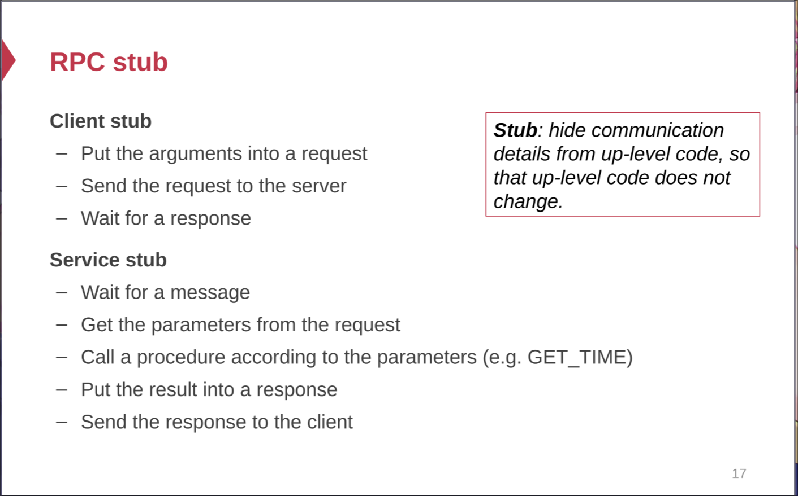

## Inode-FS
	- Layers
		- Block Layer:
			- 4KB Size per block (maybe but adjustable)
			- Contains bitmap to track the usability of the block
			  id:: 654f666b-a243-49f6-8077-f1324f3092b4
		- File Layer:
			- **Representative**: Inode
			- Resides in the block too. Holds the location where real data stores and the file's **metadata**.
			- 
			- Indirect holds another map to block which holds other indirect blocks
			- Only the direct block holds the real data block which stores the actual data
		- Inode number layer
			- Just an array stores behind the block bitmap's with also inode's bitmap
			- Indicates the block number of the inode layer
		- File Name Layer
			- Hide metadata of file management
			- Separate the directory type and regular file type
			- Holds the mapping from the filename to the inode number.
		- Path Name Layer
			- 
			- Recursively look up the directory inode untils it lands on the regular files.
			- The inode number of the root directory is fixed. In the case of the ext4, it's assigned with 1. Note that we don't have number 0 here, since it represents the dysfunction of the file system.
	- ### Links
		- 
		- Two semantic abstractions
			- LINK (from, to) --- to's name to from's inode
			- UNLINK (name) --- decrease the reference count of the inode where name points to.
		- Create Shortcut from one link to another.
		- We store the reference count inside the inode.
		- We increment the refcnt of the inode if one link is formed. The default is always one.
		- When the reference count of the inode reaches zero, we can safely remove the inode and free the data blocks.
	- #### Renaming(from,to)
		- When renaming, it should be guaranteed that LINK(from, to) is done atomically and should not fail.
	- #### Two Types of lINKS
		- Soft Link --- only associates the destination with the name
		- Hard Link --- associates the destination with the inode number
	-
- ## FAT System
	- **Only Two Layers**
		- File associated entry
			- starting from the root and finds the first block of the backed file and traverse the linked list.
		- Free List
			- contains the free block number and perform allocation and garbage collecting based on this free list.
		- 
		- Linked List Structure
			- Point to the end of the block list when ended.
		- Directory
			- Hold the next file entry until it reaches the end.
			- Hold the metadata of the file and the entry of another file/directory.
			- 
		- Advantage:
			- Naive and simple --- used as the supporting file system for efi when designing the UEFI boot system
- ## File System Abstraction
	- ### Open
		- Gives the process a fd in its own fd table which points to an entry in the file table
		- Each process has its own fd table but shares the file entry table on the OS level
		- One open increase the reference count of the file table entry and the file itself,  each child process will increase also
		- However, another open will get to another entry separating the file cursor apart from each other
	- ### Close
		- Remove the fd table entry from the process
		- Decrement the reference count of the file table entry
		- Remove the file table entry if the reference count reaches zero
	- ### Read
		- Move the file cursor and read the data block.
		- Update the **Access** time (which means write operation )of itself and its all ancestors recursively (Can be disabled via system-level noatime mount)
	- ### Write/Append (No need to mention here)
	- ### Sync
		- Flush the page cache to the disk
		- Ensure that all the content is flushed into the disk on time or on recovery whatever it may happen.
	-
- ## RPC
	- > RPC Stands for Remote Procedure Call which provides an easy-to-use executional and functional abstraction without coding the details for the remote interaction.
	- ### STUB
		- STUB Translate the function call into the internet message and transmit the requests and responses accordingly over the network ports.
		- Responsibility:
			- 
		- #### Request Message
		- 
		- #### Response Message
		- 
	- ### Parameter Passing
		- Parameter Passing needs a machine-independent, language independent byte encoding.
		- Two types of format representations
			- Human Friendly: more verbose but needs more bits to store
			- Machine Friendly: less verbose but needs less bits to store
	- ### Failure Recovery
		- Network Failure can happen when on requesting, server transmission and even responding.
		- Requests resending is not tolerable since a lot of transaction is not Idempotent
		- We need semantics that can support that only zero or one request can be sent to the server for responding.
	-
- ## Network File System
	- ### NFS
		- We don't have open and close here We only get a mount operation which returns a file handler to the client.
		- #### File Handler
			- File System Identifier
			- Inode Number -- Dealing with renaming
			- Generation Number  -- Versioning (in case of deletion and reallocation happens)
		- #### Performance
			- We need caching on client sides to get ride of excessive read,readlink,getattr,lookup,readdir
			- We need cache binding, metadata and directory binding
			- Dealing With Cache Coherence
				- Type 1: Guarantee read/write coherence on every operation or simply for some kinds of operations
				- Type 2:  Close-to-Open Consistency (we need to perform getattr when opening and flushing all writes when closing)
		- ### VFS
			- In memory abstraction over different implmentations
			- Provides a highly abstracted set of APIs including OPEN, READ, WRITE, CLOSE
			- Even FS with no real local files supported can be abstracted this way (Proc FS)
			- #### Validation
				- Both server and client save timestamp of files
				- We always need to validate the consistency between the client and the server
				- Data Block should be flushed on close
				- 
				-
			- #### Performance Improvment
			- 
		- ### GFS
			- #### Distributed Block Layer
				- Data Blocks are distributed across multiple data-server
				- Inode table is stored on the master server and path name resolution on the metadata server.
			- #### Interfaces
				- Only Create/Delete/Open/Close/Read/Write
				- Additional: Snapshot/Append
				- Unupported Ops: Link, Symlink, Rename
			- #### Architecture
				- Master + N Replicated Chuck Servers
				  Features:
					- Large Chunk  (64MB)
						- Reduce the need for frequent communication with master for chunk location info
						- Make it feasible to keep a TCP connection open for a extended time
						- Master Stores all metadata in memory
					- Master:
						- Replicates the metadata
						- Maintains the metadata of the whole file system
						- Store all the data in the memory and persist an operation log
						- Chunk Location is not stored persistently for consistency management
			- #### Client
				- No OS Level API (No syscall / trap)
				- Interacts with master and chunk server directly
				- No caching
			- Operations:
				- Writing a file needs a lease (same as a versioning) issued by the master.
				- Deliver data before writing
					- Send the data to the closet primary server
					- Wait for primary ack
					- Send a write request to the primary
					- Logging when primary before writes
				- No Directory here,  everything is flatten out with a single lookup table.
- ## Consistency Models
	- ### Strict Consistency
		- Coherent to the global time no compromise.
		- Operation happens one by one and no overlaps
	- ### Sequential Consistency
		- Consistent issue to complete in a single program in one machine
		- No operation reordered due to network latency with in that program
	- ### Linearizability
		- If operation is issued, it must be able to see to the changes happened before it's issued
		- If certain operations overlaps from one another, the consistency is relaxed.
		- #### Implementation
			- We use a sequence number just like TCP to reorder the write operation
			- Read Operation Can be relaxed by local caching so we can read the cache.
	- ### Causal Consistency
		- Causal Consistency is a higher level of consistency meaning that one operation should have an effect on the sequential order of operations
		- #### Implementation
			- Ordered operation log --- log the operation before performing it and reorder the log based on some order --- Time
		- We issue the <Time T,  Node ID>  to reorder the logging and to use as a tiebreaker if timestamp comes to a tie.
		- To
- ## All or Nothing? Logging
	- ### Redo Logging
	- ### Undo Logging
	-
- ## Core of transaction and block atomicity -- 2PL and OCC
-
- ##
-