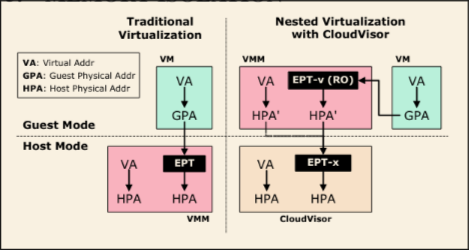

- 
- ## Terminology
- ### Second Level Address Translation
- In a old-fashioned way, guest virtual address should first be translated into  its physical address and then propagates into the host's physical address.
- Shadow paging is the technique to translate the guest's virtual memory directly into the host's physical address.
- The translation is then upside down. The host's virtual memory table is concatenated behind the guest's virtual memory table and the translation process is propagated only in one stage in the MMU.
-
-
- ## Introduction
- ### Background
- Multi-tenant cloud is facing the serious threat of security compromise because the growing size of the trusted computing base introduced the exponential size of VMM and management tools codebase.
- VMM platform's size which accounts for a large portion of TCB has become so large that it's really a big challenge to instigate a correct mitigation of it. Sometimes the VM just gets jailbreaks and escapes from the virtual environment, or just crashes the entire host kernel.
- Current protection methods only focus on VM side's attack but lack the protection on the operator side on the precondition that the operator is trusted and therefore moral enough to not steal the client's data.
- ### Previous works (In terms of VMS)
- #### Maybe no virtualization at all?
- #### Maybe a microkernel?
- #### Maybe
- ### ShortComings
- It does not guarantee protection against side channel attack.
- ## Architecture
- >    TCG Attestation protocol is a transmission protocol neutral, endpoint integrity accessment protocol. it specifies how the verifier can check whether or not certain components  are compromised by the requested attesters. #[[TPM TCG]]
	-
	- ((65216807-c411-4fbf-bd05-e7bee4db95d9))
- > To sum up,  the cloudvisor acts  just as a interceptor and contains the whole virtual machine management platform inside a single virtual machine. Cloudvisor runs in the privileged mode and takes charge of the address translation, IO control and ownership control.
- ### Control Transition
	- ((65216e71-4b24-4688-aa2e-681f4b76d257))
	- Interpose the VM exit event and intercept the VM entry.
	- During external interrupts in which the general purpose registers are not used, the cloudvisor help reset all the registers before calling an vm_entry to the VMM.
	- Cloudvisor takes the responsibility if  saving and restoring the CPU context before going back the the VM.
	- Cloudvisor maintains the VMCS structure #VMCS
	-
	-
- ### Memory Protection --- Nested Paging
- 
- It just another layer on the original nested paging technique.
- Originally, the virtual machine platform runs in the host mode and uses the MMU to leverage the nested paging with shadow paging.
- In cloudvisor mode, the cloudvisor translate the vmm's address and the vmm translate the vm's memory address. So in short, there are three layers.
- ### Memory Protection --- Ownership Tracking
- > ((651ad4e6-2bdf-4bc0-baa6-f8b1266f0642))
- > ((651ad501-20e0-4681-847c-f6a773f1ddac))
- >((651ad87f-0b2b-4df4-95b7-a521af1b25fc))
- Every time the VMM tries to update the SLAT table, the cloudvisor intercepts it when the EPT is updated because of VMM tries to update its page table in the SLAT.
- When a new page is mapped, the cloudvisor unmaps it from the VMM and transfer it to the VM
- When a new page is unmapped, the cloudvisor unmaps it from the VMM, **encrypts it** and transfer its ownership to the VMM. so that any malicious vm can not steal the memory fron another.
- Notice that, the whole process is under the control of ownership tracking.
- DMA-device is all denied for access when the VM instigates. The IOMMU translation is shutdown by the cloudvisor and is only available for vmm and cloudvisor. Therefore It's the cloudvisor's responsibility to properly handle the DMA interrupt.
	- ((652170fc-2908-4a7c-a303-06a9203c99fd))
- ### Disk Storage
- #### Data Exchange
- DMA -- use a temporary buffer to copy the data between the VMM-based device and the guest VM.
- Port -- use a whitelist to decide whether VMM is allowed to exchange data with the proposed VM.
	- ((6521753d-0dc0-4194-9c87-1c910a8677fb))
- #### Disk IO
- Use AES-CBC to encrypt the data in the granularity of disk sector.
- Use a merkle tree to construct the hashing link of the entire disk.
- Every time a read operation is pending, the cloudvisor first calculate the hash of the given block and validates it with the given merkel hash. If the validation succeeds, the decryption comes right after.
- The write operation is similar except that the new IV and hashes should be generated.
- **Hash, IV and Write operations are not atomic.** So it's not crash tolerant.
-
- ## Performance Optimization
- Boosting I/O with hardware support.
	- SR-IOV
	- Shadow Paging
- Reducing unnecessary VM exits
	- Allocating an in-memory cache for disk IO
- ## Dealing with Soft and Hard Reset
- An attack might issue a soft reset and tries to read the memory content owned by a leased VM. Since the INIT signal is intercepted by the cloudvisor, the Cloudvisor will scrub all the memory in leased VM and **itself** completely.