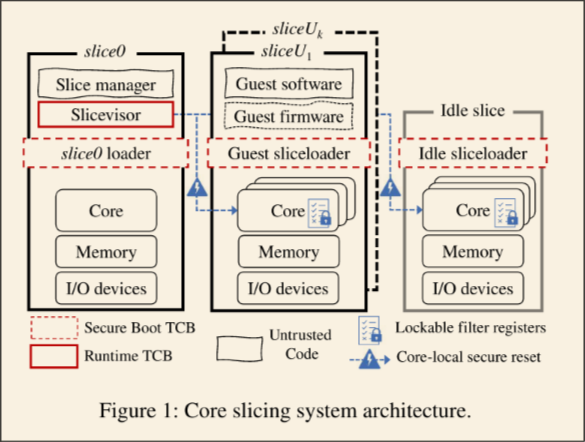

- 
- ## Abstract
	- Current Status of hypervisor-based cloud platforms
		- Side Channel Attack Vulnerability
			- ((65153b00-e54b-495b-9577-b77d66cc3a6d))
		- Breakthrough
			- ((65153c32-5f1a-4006-b2a1-b7265791d203))
	- **conclusion**: Bare-metal isolation on system's cores, memory space and even IO devices is feasible and necessary.
- ## Introduction
- TEE executed on a type II/I hypervisors provides private memory and a trusted context switch, however since multiple guests and hosts still run on the same hypervisor platform (e.g. KVM), the hypervisor is still vulnerable to several mainstream side channel attacks.
- ### Facts
	- Cloud provider does not care about runtime delegating and resource re-partitioning and statically allocate IO devices, memory, CPU cores and disk spaces.
		- ((651545fb-4787-45d4-828a-543ffa0b1bc1))
	- Virtual I/O is now needed, always granting the users with direct device support backed a bus device.
		- ((651702c6-5ed6-4745-8eec-7f3f5564c8eb))
	- Advanced VM features are often disabled s.t. memory ballooning
- ### Design Overview
- Slice managers are designed on the bare-metal hardware levels, and ideally run on a separate processor across the board.
- Chapter 2 -- Guest kernels or systems cannot assume the starting address of the memory, the contiguity of the CPU cores or any other hardware IO devices that are attached to them by the slice managers.
- Chapter 3 -- Lockable filter registers and core-local secure reset mechanism grants the technique of core slicing.
- ### Practicality of the system design
- Chapter 4 -- RISC-V Prototype
- Chapter 5 -- x86-based prototype
- Chapter 6 -- Performance evaluation (Not really important)
- ## System Design
- 
- Core 0 as a individual slice and holds a slice visor and controls the behavior of other slices and a single idle slice. It's able to split the idle and garbage collecting the unused allocated slices.
- Each slice holds its immutable and individual amount of resources and cannot be shared across the partitions.
- Slice manager can only schedules the allocation and collection. It cannot access the memory space of each splice. Only the slice visor does all the job of resource management.
- ### Lockable filter registers
	- > ((6516cbff-567d-426a-be9c-0de63ca33486))
	- > ((6516d06e-043a-4b40-9575-9b066bba9ec4))
	- Filter registers have four types:
		- Memory: Range checks are done in TLB and generated and managed in slice manager when the page translation is done.
			- ((6516d23c-6c07-4767-947b-320453fad47d))
		- Cache: cache partitioning supported by hardware platforms
		- Interrupt: use lockable IPI destination mask register which forbids cores from other partition to send interrupt to it.
		- I/O device: Allocate physical memory buffer directly to iommu physical functions for SR-IOV
			- ((6516d2d6-05bf-42a2-8a74-5c5191a8393e))
- ### Firmware and guest kernel
	- > ((651703e5-aa85-4ea8-93ad-67c40217e69c))
	- > ((651703f4-80f1-467c-b41a-2ad88564b6d7))
- ### Slice Communication
	- It's performed on a slice bus by leveraging shared memory between slice and slice 0 and IPI signaling.
- ### Unsupported Features
	- Lacks live migration for guest
	- Slice manager and slice visors are expected to be able to be updated online without guest interruptions but still under consideration.
	- Memory Encryption is missing
- ## Prototypes
- ### Risc-V
	- Memory: Hardwired PMP Registers
	- IPI Interrupts: Each processor is unique in memory-mapped registered which can be covered by PMP mechanism
	- Cache Partitioning: Way masking
	- Core Reset: **Unavailable. Can only be called by a system reset.**
	- Slice host and guests communication: Dedicated bus communication
	- Slice loader: Modified Bootloader to construct a device tree
	-