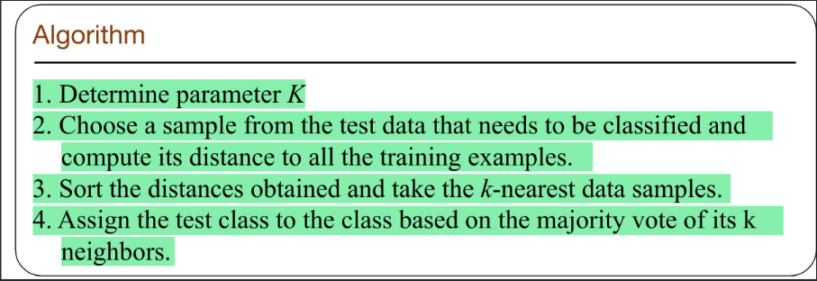

- 
- To classify certain objects, we simply refer them to groups and expand the boundary of groups based on the distances for each pair of the object.
- There are several types of distances: Euclidean Distance, Manhattan Distance, Minknowski Distance. Notice that when $(x_i - y_i)^2 \rightarrow 0$ . $\sqrt{\sum_{n=1}^{k} (x_i - y_i)^2}  = \sum_{n=1}^{k}{|x_i -y_i|}$
-
- To standardize the range of attributes, we introduce the normalization to penalize the large fluctuation for certain dimention
- ## Algorithms
- 
-
- We calculate the distance or similarity (e.g. cosine similarity) and rank the score and select the label for each data. This can be unsupervised since each label  can be independent.