## Basic Concept
- A Basic metrics to evaluate the fitness of the model is its ability to generalize on certain aspects of tasks
- ### Underfitting
	- The model isn't complex enough to capture the real knowledge of the data.
	- Assumption fails to hold
- ### Overfitting
	- The model is too complex and captures the detailed data too much.
	- #### Ways to Prevent
	- Increase the training data.
	  logseq.order-list-type:: number
	- Regularization.
	  logseq.order-list-type:: number
	- Dataset Partitioning
	  logseq.order-list-type:: number
- ### Loss Function
- ### System Design
-
- ## Linear Regression
- Estimating the hyperplane to estimate the regression trend.
- **Loss Function**: $L(w, w_0 | D ) = \frac{1}{2N} sum_{l=1}^{N} (r_l - y_l)^2 = \frac{1}{2} (r - y) (r - y) ^T = \frac {1}{2} (r-Xw)^T(r-Xw)$
- Solution: $\frac{\partial L}{\partial w} = -X^T(r-Xw) = 0$
- $w = (X^TX)^-1X^Tr$
- Geometric explanation: the column vectors form a subspace of  $R^n$, so the estimated $y$ is to minimize the projectioan distance between $r$ and $y$.
- ---
- ## Classification Model
- ### Decision Tree
- Divide and conquer to separate the tags across a wide range of attributes.
- #### Algorithm: ID3 Algorithm
- Steps:
- Select a field of partitioning the dataset to get the maximum information gain
  logseq.order-list-type:: number
- Calculate the purity or information entropy based on the new partition.
  logseq.order-list-type:: number
- 
- ### Naive Bayes
- Deduce the posterior probaibility based on the joint probability.
- Vulnerable to underfitting for each item's presence in the predicted classes.
- We assume that the conditions are independent distributed so using the bayes rules.
- To decide whether the attribute group $(c_1,c_2,c_3,...,c_n)$ belongs to $c_p$,
- $c_p = argmax p(c_p) \Pi_{i=1}^{n} p(c_i | c_p)$
- ### KNN Classification
- Find the closet point and join the category. voting by the distance using least distance estimation.
- ### Logistic Regression
- We want to find a line that can maximize the confidence score of a maximize the probability of a entity in a specific class. In this specific model, we want to find a specific hyperplane such that $p(c1 | x) = 1 ,p(c2| x) =0$
- This is crucial since we want to ind a linear logistic model to model this problem.
- #### Softmax/Sigmoid
- Since we cannot find the gradient of a zero one bernouli distribution, we need a estimation by its posterior combination.
- So we loose the constraint hoping that the correct class will fall over 0.5
- 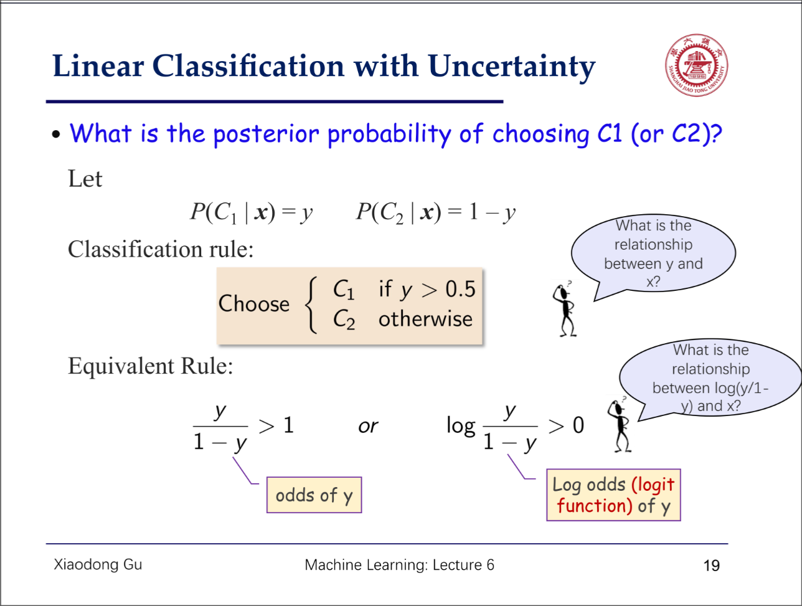
-
- We need the logit loss of  log since we want to find the posterior using the baysecian laws since we assume that the distribution is gaussian and we want to map the logit function of gaussian can simply map to the linear combination of x.
- So we introduce the sigmoid function.
- 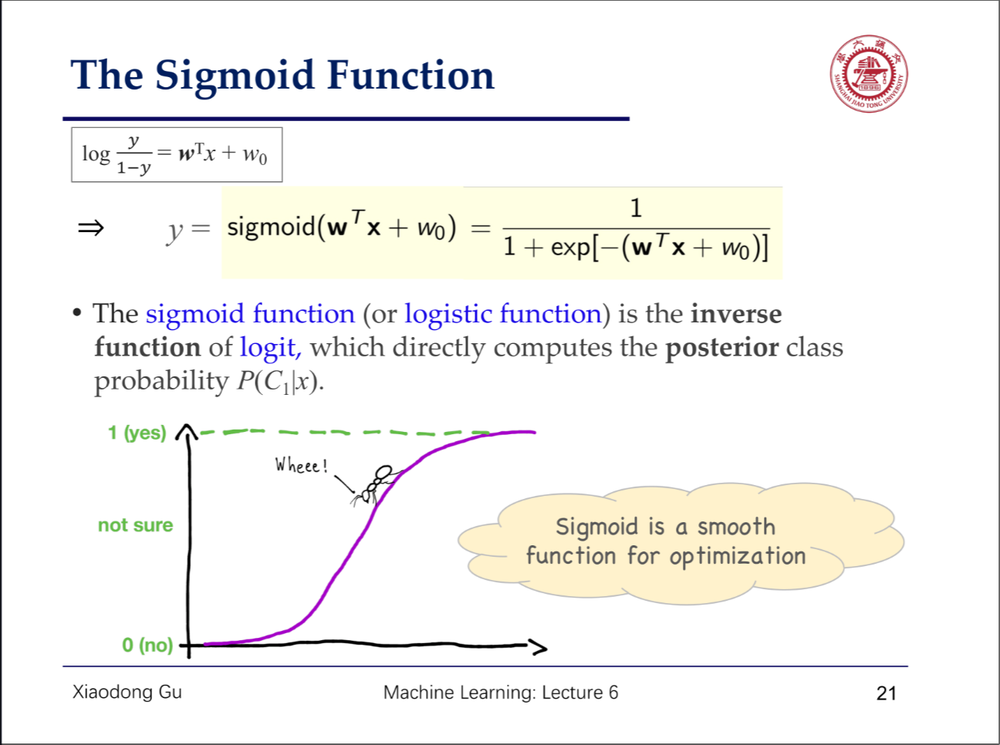
- For multi-variable distribution, simply we need to map this to IID then we got softmax regression.
- 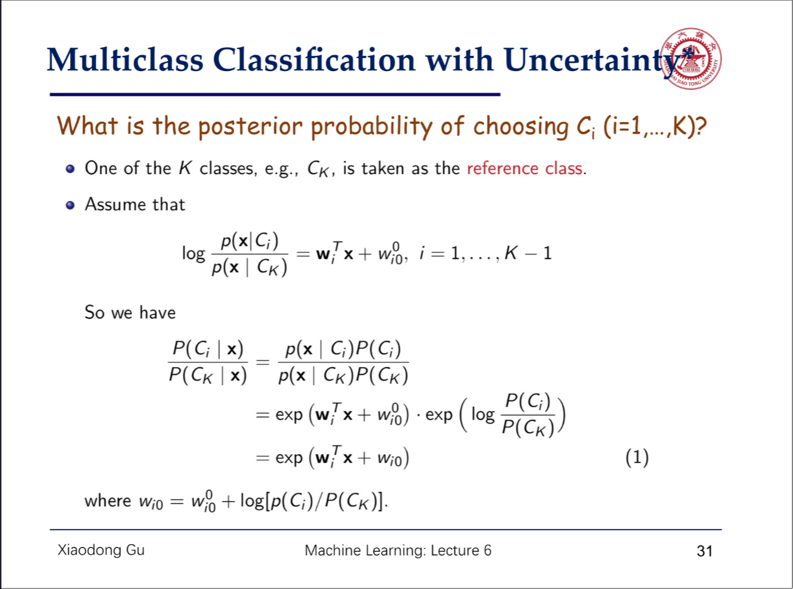
- #### Cross Entropy Loss
- 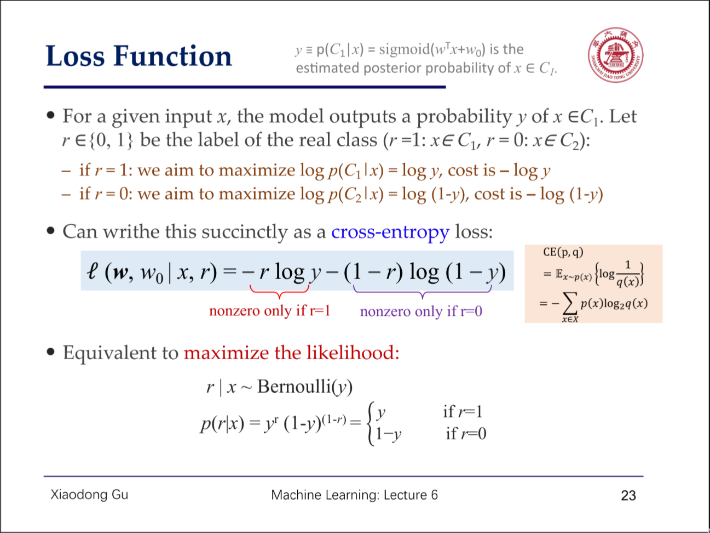
- 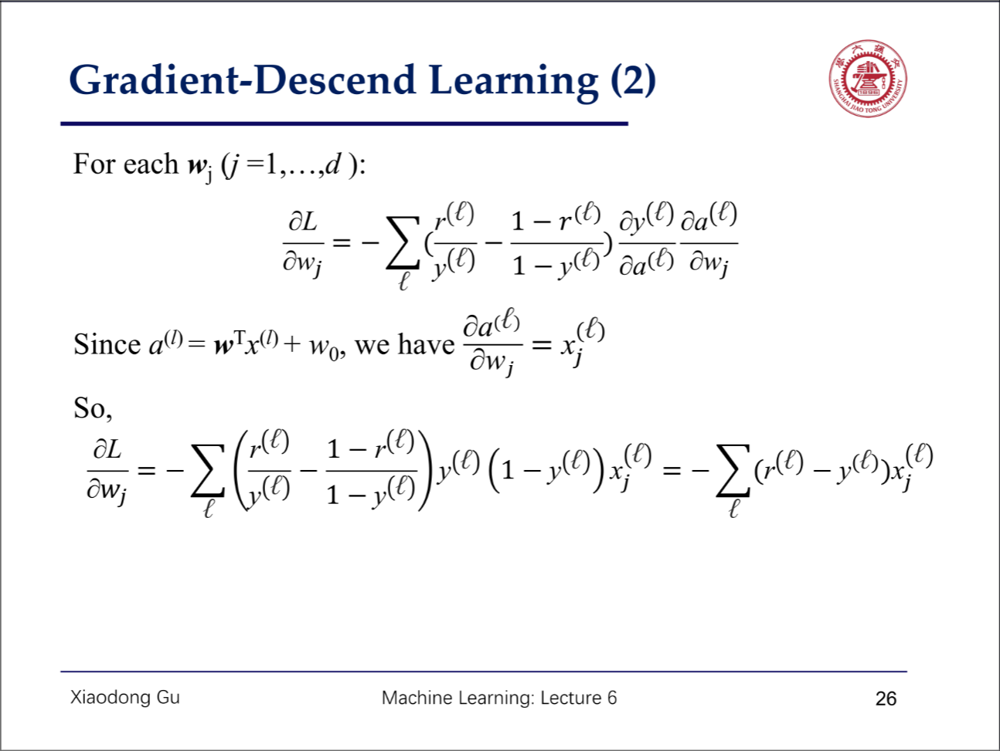
- 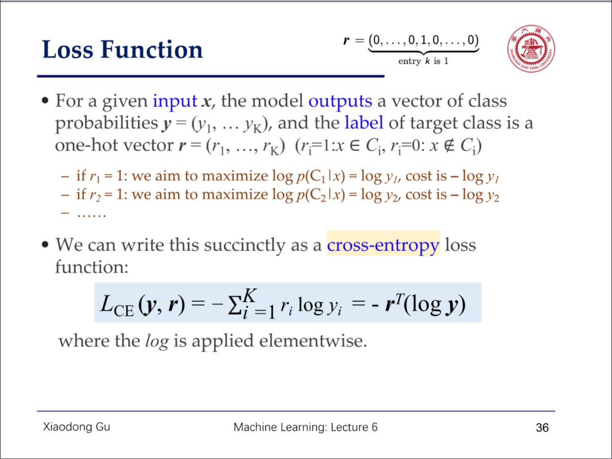
- ### Support Vector Machine
- Simply we want to find a hyperplane that can support the interspace of the given dataset.
- Notice that simply we want to find such a line such that
- 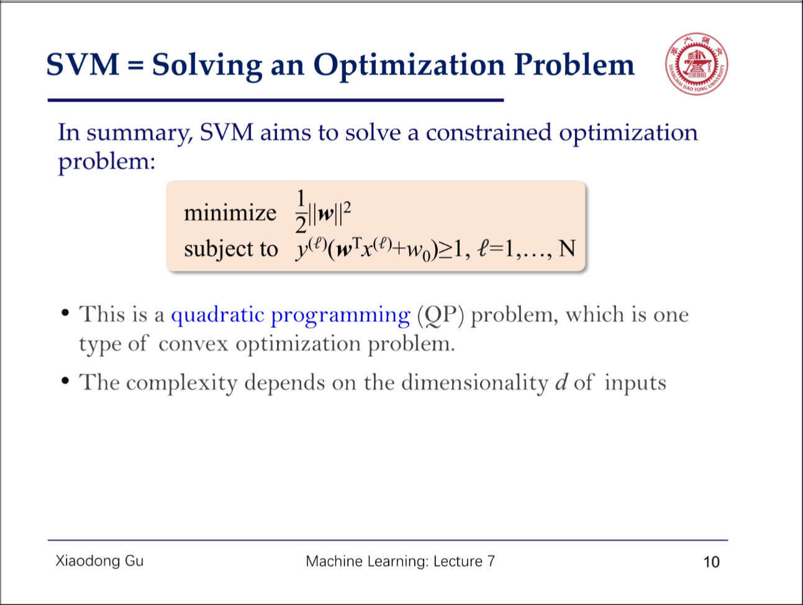
- 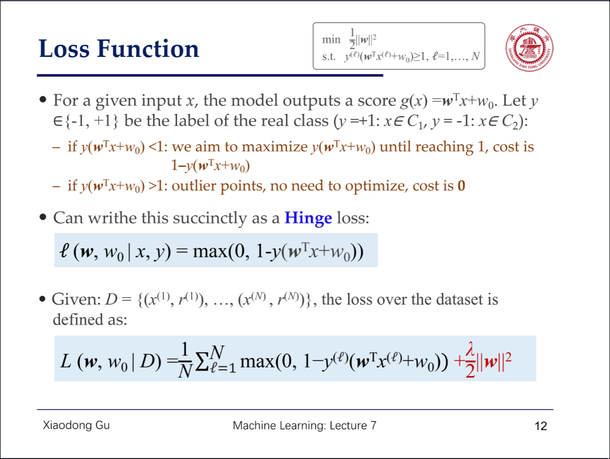
- 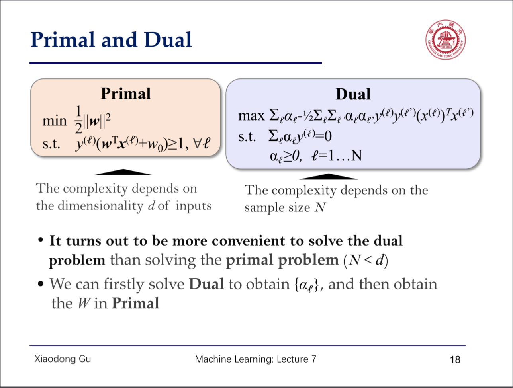
- 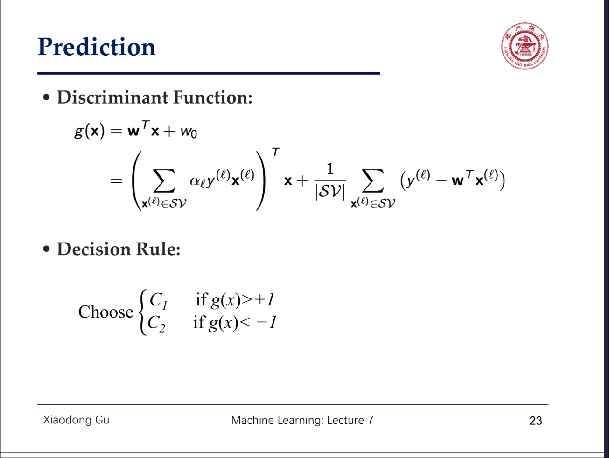
- 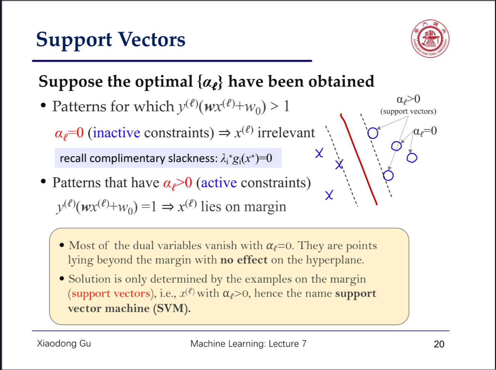
- 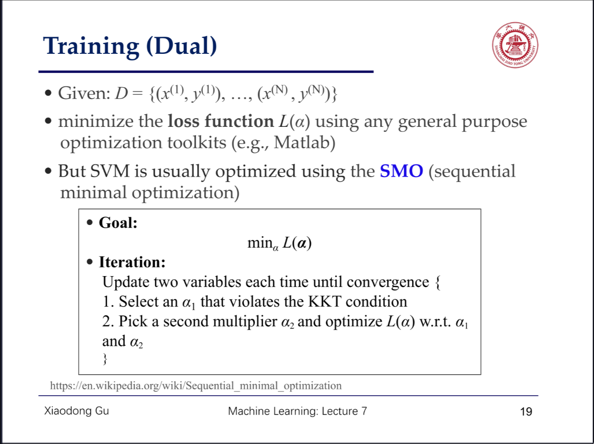
- Once we find all the $\alpha$, find the supporting vectors and calculate the w and w_0.
- ---
- ## Neural Network
- ### Perceptron
- #### Hidden Layer
- Hidden Layer allows for learning a mapping that is not constrained by linear seprability
- Introduce non-linearibility on activation function and maintain the linearibility kernel-wise.
- #### MLP
- Multilayered Linear Perceptron
- Forward Pass and Backward Pass.
- BackPropagation - Backward Pass
- #### Deeper ? The Better?
- The total idea is that we divide the problem and dispatch them to different modules to solve.
- Each layer is activated by the non-linear activation function.
- ---
- ## NLP
- ### Word Embedding
- We need to transform the word into a certain vector or tokenize it.
- #### Word2Vec
- #### CBOW
- #### Skip-gram
- ### Recurrent Neural Network
- #### Long Short Term Memory
- Forget Gate
  logseq.order-list-type:: number
- Store Gate
  logseq.order-list-type:: number
- Update Gate
  logseq.order-list-type:: number
- Output Gate
  logseq.order-list-type:: number
- 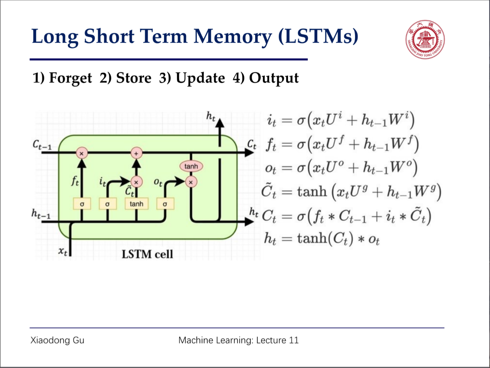
-
- ### Transformers
- #### Seq2Seq Attention Map
- #### BERT
	- Encoder Based from words to something we want to encode
	  logseq.order-list-type:: number
	- Masked Language Model (MLM) 
	  logseq.order-list-type:: number
		- Randomly mask 15 % of the input tokens and predict the original tokens.
		  logseq.order-list-type:: number
	- Sentence Classification
	  logseq.order-list-type:: number
		- Assign a classifier to the output of the BERT
		  logseq.order-list-type:: number
	- Word Tagging 
	  logseq.order-list-type:: number
	- Reading Comprehension
	  logseq.order-list-type:: number
	- logseq.order-list-type:: number
- #### GPT
	- Decoder
	  logseq.order-list-type:: number
	- From words to other words or from hidden features to the words (Dall-E / GPT)
	  logseq.order-list-type:: number
- ---
- ## Convolutional Neural Network
- Lessons we've learned so far are all based on linear features.
- However, in the basic instinct of analyzing images, we need spatial information.
- Therefore, we need the convolutional neural network based on convolutional kernel.
- After 3-D cnn , the image outputs a series of feature maps based on different features.
- $Size = (N-F+2P)/Stride + 1$
- ### UNet
- Semantic Segmentation
  logseq.order-list-type:: number
- Encoder-Decoder Network
  logseq.order-list-type:: number
- Transposed Convolution for upsampling#
  logseq.order-list-type:: number
- ---
- ## Unsupervised Learning
- ### K-Means
- ### Principal Component Analysis
- Find the eigenvalues and eigenvectors and rank them based on the eigenvalues.
  logseq.order-list-type:: number
- Normalize the data to the mean of 0
  logseq.order-list-type:: number
- Multiply the data by the eigenvectors determined by the target dimensions.
  logseq.order-list-type:: number
- ### Auto Encoder
- We have a latent variable $z$ and we predict the latent z or rebuild the distribution based on it(VAE)
  logseq.order-list-type:: number
- ###  GAN
- Generator:Derive a random noice and generator tries to convert the normal distribution to the designated distribution.
  logseq.order-list-type:: number
- Discriminator: tries to discriminate between the fake one and the real ones.
  logseq.order-list-type:: number
- ### CycleGAN
- ### Diffusion Model
- ---
- ## Reinforcement Learning
- ###  DQN Network
- Basic thought is to predict the decision(Q) based on the current condition a
  logseq.order-list-type:: number
- ### Value Network
- Basic thought is to the
  logseq.order-list-type:: number